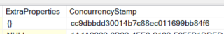

# ABP Framework

- 一個現有的架構套件，可直接使用許多做好的模組，不用再手刻整個架構
  - IoC Container: Dependency injection內建，簡單繼承interface就不用註冊implementation
  - ORM & Unit of work: 整合Entity framework，可利用Unit of work操作DB scope
    - Audit Log: 內建Entity Log，不用再自己寫DB Table來存取資料更改紀錄
  - Domain Driver Development: 內建領域驅動物件 (如AggregateRoot, Entity)，可方便套用架構
  
## 安裝


## Entity Framework

- ABP為DB實作了一套包含Unit of work、Audit log、Soft delete、常用欄位(如作者、時間)等等功能的架構，可以很方便套用

### AggregateRoot

- AggregateRoot是領域驅動設計(DDD)中的核心概念，代表一個聚合的根實體
  - 作為整合性物件，其下可包含Entity、Value Object等子物件
  - 定義聚合邊界，確保業務規則的一致性
  - 所有對聚合內部物件的存取都必須透過AggregateRoot進行 (子物件為Owned)
  - 是Repository操作的基本單位，每個AggregateRoot都應該有對應的Repository
- AggregateRoot會實作以下必要columns
  - ConcurrencyStamp: 作為Save依據，避免重複Save衝突 (此欄位注意DB不可以為NULL! 沒有值的話至少為`GETID()`)
  - ExtraProperties: 儲存額外serialize string資訊 (此欄位注意DB不可以為NULL! 沒有值的話必至少為`'{}'`)
  
  
- 可自行選擇Implement不同等級的Interface (有implement到的欄位DB必須要有對應的Column，一個也不能少!)
  - **FullAuditedAggregateRoot**: 完整記錄功能 (creator/editor/deleter/soft delete/time)
  - **AuditedAggregateRoot**: 創建+修改紀錄 (creator/editor/time)
  - **CreationAuditedAggregateRoot**: 僅創建紀錄 (creator/time)
  - **AggregateRoot**: 基礎版本 (Id, ConcurrencyStamp, ExtraProperties)
- 也可以選擇性只apply部分欄位
  - **IFullAuditedObject**: 完整記錄欄位介面
  - **ISoftDelete**: soft delete功能 (IsDeleted欄位)
  - **IMayHaveCreator**: 可選創建者欄位 (CreatorId可為null)

### Entity

- Entity是Aggregate用於擴充的基本,為Domain object的原型
- Entity與AggregateRoot類似,但層級較低,通常作為Aggregate的子物件使用
  - **Entity**: 基礎版本 (Id)
  - **CreationAuditedEntity**: 僅創建紀錄 (creator/time)
  - **AuditedEntity**: 創建+修改紀錄 (creator/editor/time)
  - **FullAuditedEntity**: 完整記錄功能 (creator/editor/deleter/soft delete/time)
- Entity與AggregateRoot的差異
  - Entity沒有ConcurrencyStamp和ExtraProperties欄位

- 使用範例

    ```C#
    // AggregateRoot with Entity
    public class Order : FullAuditedAggregateRoot<Guid>
    {
            public string OrderNumber { get; set; }
            public List<OrderItem> Items { get; set; } // OrderItem is Entity
            
            public Order(Guid id, string orderNumber) : base(id)
            {
                    OrderNumber = orderNumber;
                    Items = new List<OrderItem>();
            }
            
            public void AddItem(Guid productId, int quantity)
            {
                    Items.Add(new OrderItem(Guid.NewGuid(), productId, quantity));
            }
    }
    
    // Entity as child object
    public class OrderItem : Entity<Guid>
    {
            public Guid ProductId { get; set; }
            public int Quantity { get; set; }
            
            protected OrderItem() { } // EF Core需要
            
            public OrderItem(Guid id, Guid productId, int quantity) : base(id)
            {
                    ProductId = productId;
                    Quantity = quantity;
            }
    }
    ```

#### Entity Event

- 於Entity當中有Create/Update/Delete時所觸發的Event

```C#
// Entity with built-in events
public class User : AggregateRoot<Guid>
{
    public string Name { get; set; }
    public string Email { get; set; }

    public User(Guid id, string name, string email) : base(id)
    {
        Name = name;
        Email = email;
        // ABP 其後會自動觸發 EntityCreatedEventData
    }

    public void UpdateEmail(string newEmail)
    {
        Email = newEmail;
        // ABP 其後會自動觸發 EntityUpdatedEventData
    }

    // 如果經歷Entity刪除，ABP 會自動處理 soft delete & EntityDeletedEventData
}

// Event Handlers for built-in ABP events
public class UserEventHandler : 
    ILocalEventHandler<EntityCreatedEventData<User>>,
    ILocalEventHandler<EntityUpdatedEventData<User>>,
    ILocalEventHandler<EntityDeletedEventData<User>>
{
    public async Task HandleEventAsync(EntityCreatedEventData<User> eventData)
    {
        var user = eventData.Entity;
        // e.g., send welcome email, create user profile, etc.
    }

    public async Task HandleEventAsync(EntityUpdatedEventData<User> eventData)
    {
        var user = eventData.Entity;
        // e.g., notify other services, update cache, etc.
    }

    public async Task HandleEventAsync(EntityDeletedEventData<User> eventData)
    {
        var user = eventData.Entity;
        // e.g., cleanup related data, send notifications, etc.
    }
}
```

### Repository

- 內建介面可提供現有的Entity/AggregateRoot直接查詢，而不需建立Custom Repository:
  - `IRepository<TEntity, TKey>`：讀寫存取，支援CRUD與查詢
  - `IReadOnlyRepository<TEntity, TKey>`：唯讀查詢
  - `IBasicRepository<TEntity, TKey>`：僅提供最基本的CRUD操作
  - `IQueryableRepository<TEntity>`：支援LINQ查詢
  - `IRepository<TEntity>`、`IReadOnlyRepository<TEntity>`：當主鍵型別為`Guid`時可省略`TKey`
- 也可自行繼承這些介面擴充自訂Repository功能

### DbContext

- 為了讓AggregateRoot/Entity能夠被內建的IRepository使用到，需要新增Custom DbContext連動到DB
  - 必須設定Implement EfCoreDbContext，並新增Entity/Aggregate型別的DbSet，才能讓ABP在我們使用IRepository的時候抓到DbContext來產生SQL
  
    ```C#
    // DbContext interface
    public interface IUserDbContext : IEfCoreDbContext
    {
        DbSet<User> Users { get; }
        DbSet<Role> Roles { get; }
    }

    // DbContext implement (綁定Configuration)
    public class MyAppDbContext(DbContextOptions<UserDbContext> options) : AbpDbContext<UserDbContext>(options), IUserDbContext
    {
        public DbSet<User> Users { get; set; }
        public DbSet<Role> Roles { get; set; }

        protected override void OnModelCreating(ModelBuilder builder)
        {
            base.OnModelCreating(builder);

            // Method 1: Apply configuration file individually
            builder.ApplyConfiguration(new UserConfiguration());

            // Method 2: Optionally apply all configurations in assembly
            // (此方法比較不用每次新增Configuration都要改Code)
            builder.ApplyConfigurationsFromAssembly(typeof(MyAppEntityFrameworkCoreModule).Assembly,
                                                    c => c.FullName.StartsWith("MyApp.EntityFrameworkCore.Configurations.Users", System.StringComparison.OrdinalIgnoreCase));
        }
    }
    ```

    ```C#
    // Config (About DB table / key / constraint / releations)
    public sealed class UserConfiguration : IEntityTypeConfiguration<User>
    {
        public void Configure(EntityTypeBuilder<User> builder)
        {
            builder.ToTable("User")
                   .ConfigureByConvention();
        }
    }
    ```

    ```C#
    // Module (綁定DbContext)
    [DependsOn(typeof(AbpEntityFrameworkCoreModule))]
    public class MyAppEntityFrameworkCoreModule : AbpModule
    {
        public override void ConfigureServices(ServiceConfigurationContext context)
        {
            _ = context.Services.AddAbpDbContext<UserDbContext>(options => options.AddDefaultRepositories<IUserDbContext>(includeAllEntities: true));
        }
    }
    ```

## Audit log

- 為內建方法自動將Property改動存成Log到DB
- 預設不支援Enum轉型 (Enum只會存成int)，客製化需求(比如顯示Enum description or value)需做覆寫
- 範例

    ```C#
    // nuget
    dotnet add package Volo.Abp.AuditLogging
    dotnet add package Volo.Abp.EntityFrameworkCore
    dotnet add package Volo.Abp.EntityFrameworkCore.SqlServer
    ```

    ```C#
    // setup DB & AutditLogging modules
    using Volo.Abp.AuditLogging;
    using Volo.Abp.EntityFrameworkCore;
    using Volo.Abp.Modularity;

    [DependsOn(
        typeof(AbpAuditLoggingModule),
        typeof(AbpEntityFrameworkCoreModule),
        typeof(AbpEntityFrameworkCoreSqlServerModule)
    )]
    public class MyAuditLoggingModule : AbpModule
    {
        public override void ConfigureServices(ServiceConfigurationContext context)
        {
            Configure<AbpDbContextOptions>(options =>
            {
                options.UseSqlServer();
            });
        }
    }

    ```C#
    // setup DB connection
    using Microsoft.EntityFrameworkCore;
    using Volo.Abp.AuditLogging.EntityFrameworkCore;
    using Volo.Abp.EntityFrameworkCore;

    public class MyDbContext : AbpDbContext<MyDbContext>
    {
        public DbSet<AuditLog> AuditLogs { get; set; }

        public MyDbContext(DbContextOptions<MyDbContext> options)
            : base(options)
        {
        }

        protected override void OnModelCreating(ModelBuilder modelBuilder)
        {
            base.OnModelCreating(modelBuilder);
            modelBuilder.ConfigureAuditLogging();
        }
    }
    ```

    ```C#
    {
        "ConnectionStrings": {
            "Default": "Server=localhost;Database=MyDb;Trusted_Connection=True;"
        }
    }
    ```

    ```C#
    // Register module
    public class Startup
    {
        public void ConfigureServices(IServiceCollection services)
        {
            services.AddApplication<MyAuditLoggingModule>();

            services.Configure<AbpAuditLoggingOptions>(options =>
            {
                options.IsEnabledForAnonymousUsers = true; // 設定是否啟用對匿名用戶的審計
            });
        }

        public void Configure(IApplicationBuilder app, IWebHostEnvironment env)
        {
            app.InitializeApplication();
        }
    }

    ```

- 擴充方法
  - 在Auditing前後進行自定義操作 (如Log或欄位名稱修改、新增其他log等)
  - EntityHistoryHelper

    ```C#
    public class CustomEntityHistoryHelper : EntityHistoryHelper
    {
        public CustomEntityHistoryHelper(
            IAbpSession abpSession,
            IEntityHistoryStore entityHistoryStore,
            IEntityHistoryConfiguration entityHistoryConfiguration,
            IAuditLogScope auditLogScope)
            : base(abpSession, entityHistoryStore, entityHistoryConfiguration, auditLogScope)
        {
        }

        protected override EntityChangeSet CreateEntityChangeSet(ICollection<IEntityChange> entityChanges)
        {
            var changeSet = base.CreateEntityChangeSet(entityChanges);
            // 在這裡添加自定義行為，例如記錄額外的訊息或操作
            foreach (var entityChange in changeSet.EntityChanges)
            {
                entityChange.ChangeType += " - Custom Behavior Applied";
            }

            return changeSet;
        }
    }
    ```