# Entity Framework

- [Entity Framework](#entity-framework)
  - [Code First](#code-first)
    - [DbContext](#dbcontext)
    - [DbSet](#dbset)
      - [Migrate Database](#migrate-database)
      - [Fluent API](#fluent-api)
        - [Owned](#owned)
        - [Automapper範例](#automapper範例)
      - [Many to many Relationship](#many-to-many-relationship)
      - [Eager, Lazy, Implicit Load](#eager-lazy-implicit-load)
    - [Data Setup](#data-setup)
    - [Commands (method-based query syntax)](#commands-method-based-query-syntax)
  - [Audit log](#audit-log)
  - [Database First](#database-first)
    - [.edmx](#edmx)
  - [參考資源](#參考資源)
  - [Entity Framework 9](#entity-framework-9)
    - [LINQ and SQL translation](#linq-and-sql-translation)
      - [Parameterzied primitive collections](#parameterzied-primitive-collections)
      - [Subquery](#subquery)
      - [Aggregate](#aggregate)
      - [Count != 0](#count--0)
      - [Null](#null)
      - [Order](#order)
      - [Not](#not)
      - [Group By](#group-by)
      - [ExecuteUpdate](#executeupdate)
  - [Model building](#model-building)
    - [Auto-compiled models](#auto-compiled-models)
    - [MSBuild integration](#msbuild-integration)
    - [Read-only primitive collections](#read-only-primitive-collections)
    - [Specify fill-factor for keys and indexes](#specify-fill-factor-for-keys-and-indexes)
    - [Make existing model building conventions more extensible](#make-existing-model-building-conventions-more-extensible)
    - [Update ApplyConfigurationsFromAssembly to call non-public constructors](#update-applyconfigurationsfromassembly-to-call-non-public-constructors)


## Code First

### DbContext

### DbSet

#### Migrate Database

- 務必先安裝`dotnet ef` & `Microsoft.EntityFrameworkCore.Design`，參考[MSDN](https://learn.microsoft.com/en-us/ef/core/cli/dotnet#installing-the-tools)

- CMD版本

```Bash
dotnet ef migrations add Migration_Name -c Target_DbContext --project Project_WithDbContext --startup-project Project_SetupTheConnectionString

dotnet ef migrations script FromMigrationName ToMigrationName
```


- Package manager console版本

```PowerShell
# Package Manager Console 命令
# 注意如果DbContext所在Project & connection strings專案不同，需把Package Manager Console 右上角的Default Project改為DbContext所在Project，並且手動指定Connection Strings
EntityFrameworkCore\Add-Migration Initial
# 如有多個DbContext檔案，指定其名稱
EntityFrameworkCore\Add-Migration Initial -context DataContextName

# 小心會直接更新Database!
EntityFrameworkCore\Update-Database -Verbose

# 日後更新可改用這方法產生Script，再到SSMS Run
EntityFrameworkCore\Script-Migration 0 Initial
EntityFrameworkCore\Script-Migration -From Initial -To XXX

# 這邊需要注意! Startup project會影響到EF Core取得Configuration的appsettings.josn路徑，如果Run語法失敗的話請更改Startup project再試看看
```

#### Fluent API

- 口語化定義DB Table名稱、欄位、與Entity關係、Join關係、PK、FK、Constraint等等

```C#
//MyDbContext.cs

public partial class MyDbContext : DbContext
{
    public virtual DbSet<User> User { get; set; } = null!;

    protected override void OnConfiguring(DbContextOptionsBuilder optionsBuilder)
    {
        if (!optionsBuilder.IsConfigured)
        {
            // 注意這邊的Connection string必須在Main project裡面DI註冊好 (services.AddDbContext)
            optionsBuilder.UseSqlServer("Name=ConnectionStrings:MyDb");
        }
    }

    protected override void OnModelCreating(ModelBuilder modelBuilder)
    {
        modelBuilder.Entity<User>(entity =>
        {
            // 設定Table name
            entity.ToTable("user");
            
            // 型別為int、Not null且Name為"Id"的參數，EF將自動幫忙建立PK & Identity (流水號)
            entity.Property(e => e.Id).HasColumnName("id");
            
            // 設定Column型別
            entity.Property(e => e.Name)
                .HasMaxLength(10)
                .HasColumnName("name");
            
            // 可以設定資料轉換
            entity.Property(e => e.RoleId)
               .HasColumnName("role_id")
               .HasConvertion(r => r.ToString());
            
            // 設定FoerignKey關聯其他表(1對多)
            entity.HasOne(d => d.Role)
                .WithMany(p => p.Users)
                .HasForeignKey(d => d.RoleId)
                .IsRequired(false)
                .OnDelete(DeleteBehavior.ClientSetNull)    // 注意Delete資料的行為限制
                .HasConstraintName("FK__user__role");

            entity.OwnsMany(d => d.Permissions)
                .
        });
    }
}
```

```C#
// User.cs
public partial class User
{
    public int Id { get; set; }
    public string? Name { get; set; }
    public int RoleId { get; set; }
    
    // Reference關聯物件
    public virtual Role Role { get; set; } = null!;
    public virtual ICollection<Permission> Permissions { get; set; } = new [];
}

// Role.cs
public partial class Role
{
    public Role()
    {
        User = new HashSet<User>();
    }

    public int Id { get; set; }
    public string Name { get; set; } = null!;

    // Reference關聯物件
    public virtual ICollection<Users> Users { get; set; }
}
```

##### Owned
  - 用於定義某表附屬於特定表當中，不能單獨存在，一般適用於關聯表(如多對多)
    - 優點: 
      - 主表不用特別處理關連關係的IDs，而是可以直接關連整個Owned物件
      - 附屬表不用自己建立configuration檔案，而是寫在主表configuration當中
    - 注意: 連query、update等等都不能單獨處理
    - 替換關聯關係，則需要用整個entity作替代 (可用Automapper由ID轉Entity)
  - 目標Entity加上 `[Owned]` attribute
  - 可定義一對一 `OwnsOne` 或一對多 `OwnsMany`

```C#
using Microsoft.EntityFrameworkCore;

public class MyDbContext : DbContext
{
    public DbSet<User> Users { get; set; }
    public DbSet<Role> Roles { get; set; }

    protected override void OnModelCreating(ModelBuilder modelBuilder)
    {
        // User為主表，關連多個UserRoles
        modelBuilder.Entity<User>()
                    .OwnsMany(u => u.UserRoles, ur =>
                    {
                        // 附屬表提供關連主表Id
                        ur.WithOwner()
                          .HasForeignKey(ur => ur.UserId);
                        // 附屬表提供關連副表Id
                        ur.HasOne(ur => ur.Role)
                          .WithMany()
                          .HasForeignKey(ur => ur.RoleId)
                          .OnDelete(DeleteBehavior.Cascade);
                        // 這邊還可以加一些附屬表自己的Config設定
                        ur.Property(ur => ur.Seq)
                          .ValueGeneratedOnAdd();
                    });
    }
}

public class User
{
    public int Id { get; set; }
    public string Name { get; set; }
    public string Email { get; set; }

    // Role的關連關係 (注意這邊沒有UserRoleId!)
    public ICollection<UserRole> UserRoles { get; set; }
}

public class Role
{
    public int Id { get; set; }
    public string Name { get; set; }
    public string Description { get; set; }
    public bool Active { get; set; }
}

[Owned]
public class UserRole
{
    public int Seq { get; set; }
    public int UserId { get; set; }
    public virtual Role Role { get; set; }
}

```

##### Automapper範例
  - 呈上的關連關係，可以透過AutoMapper，將關連IDs，轉換成關連Entities

  ```C#
  public class UserRoleUpdateDto
  {
      public int UserId { get; set; }
      public List<int> RoleIds { get; set; }  // 注意這邊只有ID
  }
  ```

  ```C#
  using AutoMapper;

  public class MappingProfile : Profile
  {
      public MappingProfile()
      {
          CreateMap<UserRoleUpdateDto, User>()
              .ForMember(
                dest => dest.UserRoles, 
                opt => opt.MapFrom(src => src.RoleIds.Select(roleId => new UserRole { Role = new Role { Id = roleId } })));
      }
  }
  ```

  ```C#
  public class UserService
  {
      private readonly MyDbContext _context;
      private readonly IMapper _mapper;

      public UserService(MyDbContext context, IMapper mapper)
      {
          _context = context;
          _mapper = mapper;
      }

      public async Task UpdateUserRoles(UserRoleUpdateDto dto)
      {
          var user = await _context.Users
              .Include(u => u.UserRoles)
              .ThenInclude(ur => ur.Role)
              .FirstOrDefaultAsync(u => u.Id == dto.UserId);

          if (user == null)
          {
              throw new Exception("User not found");
          }

          // 清除現有的 UserRoles
          user.UserRoles.Clear();

          // 使用 AutoMapper 更新 UserRoles
          _mapper.Map(dto, user);

          await _context.SaveChangesAsync();
      }
  }
  ```

#### Many to many Relationship

- 主表與副表、關聯表可以做各自的關聯以外，也可以簡化關聯表的property，達到直接主表關聯副表的用法
- 優點: 不需要特別操作關聯表，簡化設定與整體操作 (主表→關聯表→副表簡化成主表→副表)
- 缺點: 要更改關聯關係時，需要丟入整批副表實體，而無法只使用副表ID來關聯，整體叫吃資源

```C#
public class SchoolContext : DbContext
{
    public DbSet<Student> Students { get; set; }
    public DbSet<Course> Courses { get; set; }
    public DbSet<Enrollment> Enrollments { get; set; }

    protected override void OnModelCreating(ModelBuilder modelBuilder)
    {
        modelBuilder.Entity<Student>()
                    .HasMany(s => s.Courses)
                    .WithMany(c => c.Students)
                    .UsingEntity<Enrollment>(
                        // 這邊設定關聯表規則
                        j => j
                            .HasOne(e => e.Course)
                            .WithMany()
                            .HasForeignKey(e => e.CourseId),
                        j => j
                            .HasOne(e => e.Student)
                            .WithMany()
                            .HasForeignKey(e => e.StudentId));
    }
}

public class Student
{
    public int StudentId { get; set; }
    public string Name { get; set; }
}

public class Course
{
    public int CourseId { get; set; }
    public string Title { get; set; }
}

public class Enrollment
{
    public int StudentId { get; set; }
    public Student Student { get; set; }

    public int CourseId { get; set; }
    public Course Course { get; set; }
}
```


#### Eager, Lazy, Implicit Load

- Lazy (Deferred): 每次有需要再取得資料

  ```C#
  # Users參數必須是Virtual才能套用Lazy Loading
  var users = dbContext.Users;
  var targets = users.First().Role;
  ```

- Eager: 一次取得所需關聯物件 (Include)

  ```C#
  var usersWithRole = dbContext.Users.Include(user => user.Role).First();
  ```

  - 或可於DbContext當中自動include

  ```C#
  protected override void OnModelCreating(ModelBuilder modelBuilder)
  {
      modelBuilder.Entity<Order>()
          .Navigation(p => p.ShippingAddress)
          .AutoInclude();
  }
  ```

- Explicit: 顯式加載，使用Load手動載入

  ```C#
  var order = context.Orders.Find(orderId);
  context.Entry(order).Reference(o => o.Customer).Load();

  ```


### Data Setup

- Data Annotations
  - Value Conversions - to convert the enum to int when reading/writing to db
- [Data Seeding](https://docs.microsoft.com/en-us/ef/core/modeling/data-seeding) - to add the enum values in the db, in a migration </br>
在DbContext檔案中定義預設Rows Data，適合如LOV、Mapping表等少改且需要作為Enum的Table

- Id </br>
  設定Int Property為"Id"，EF Core將自動建立PK、Identity (流水號)

- AsQueryable </br>
  一般Select DB Repo返回的物件，屬於Lazy Loading，只有在ToList, First, Count...等執行指令時才會跑
  - 如果在Where條件中加入外部Function，會因為Linq to sql無法翻譯，而出現失效的狀況
- AsNoTracking </br>
  取得即時的資料
  
- 連動表 (Foreign Key Linked)
  - [Relationship](https://learn.microsoft.com/en-us/ef/core/modeling/relationships) (或稱Entity Reference)
    - 部分Join表可利用Relationship做綁定，配合Include指令做直接Join成單一entity的作法 (比如Entity A當中已有Property連動Entity B)

### Commands (method-based query syntax)

- AsQueryable </br>
  一般Select DB Repo返回的物件，屬於Lazy Loading，只要在ToList, First, Count...等執行指令時才會跑
  - 如果在Where條件中加入外部Function，會因為Linq to sql無法翻譯，而出現失效的狀況
  - 
- AsNoTracking </br>
  Tracking會暫存先前查詢的資料，以下情境可考慮:
    - Query:
      - Repo如果查詢相同Where條件，會返回之前查詢好的暫存內容，開啟後後可取得DB即時最新的資料
      - 唯讀且不須Save的資料，推薦開啟AsNoTracking，不進行追蹤而提升效能
    - Save: SaveChange時會比較Entity先前的改動進行追蹤，因此Query一次後、之後再Save就可以減少DB操作

    ```C#
    // Query暫存影響
    using (var context = new YourDbContext())
    {
        // 第一次查詢，實體會被追蹤
        var person1 = context.People.FirstOrDefault(p => p.Id == 1);
        Console.WriteLine(person1.Name); // 輸出：Original Name

        // 修改實體屬性
        person1.Name = "Updated Name";

        // 第二次查詢，相同的實體已經被追蹤，返回已追蹤的實體
        var person2 = context.People.FirstOrDefault(p => p.Id == 1);
        Console.WriteLine(person2.Name); // 輸出：Updated Name
    }

    ```

    ```C#
    // 開啟後比較
    using (var context = new YourDbContext())
    {
        // 查詢實體並禁用追蹤
        var person = context.People.AsNoTracking().FirstOrDefault(p => p.Id == 1);
        if (person != null)
        {
            // 修改實體屬性
            person.Name = "Updated Name";

            // 這些更改不會被保存，因為實體不被追蹤
            context.SaveChanges();
        }
    }
    ```

- Find </br>
  從Local DbContext取得資料，如果沒有才會去Query DB，類似Cache機制 (注意使用上可能會有Join Property為Null的情況)

- Aggregate
  - 優化效能使用的指令系列，只針對部分資料做計算
    - [MSDN](https://learn.microsoft.com/en-us/dotnet/framework/data/adonet/ef/language-reference/method-based-query-syntax-examples-aggregate-operators)


## Audit log

- 為內建方法自動將Property改動存成Log到DB
- ABP Framework有整合此功能，請參考ABP note

## Database First

### .edmx


## 參考資源
- [Enum to DB](https://stackoverflow.com/questions/50375357/how-to-create-a-table-corresponding-to-enum-in-ef-core-code-first)
- [Owned Entity Types](https://learn.microsoft.com/en-us/ef/core/modeling/owned-entities)


## Entity Framework 9

### LINQ and SQL translation

#### Parameterzied primitive collections

#### Subquery
  

#### Aggregate
  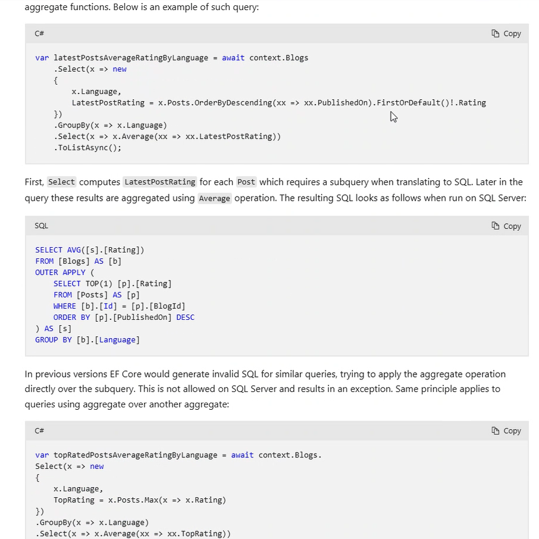

#### Count != 0

- 用Exist做取代
  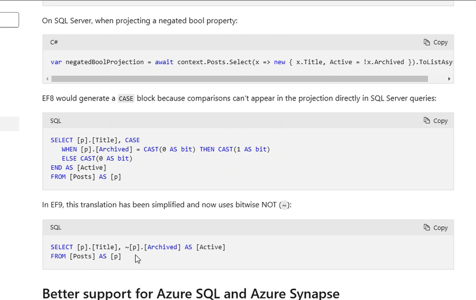

#### Null

#### Order

- 可自動抓Key，不須指定column
  

#### Not

- Not優化效能，而不是整個`NOT(...)`
  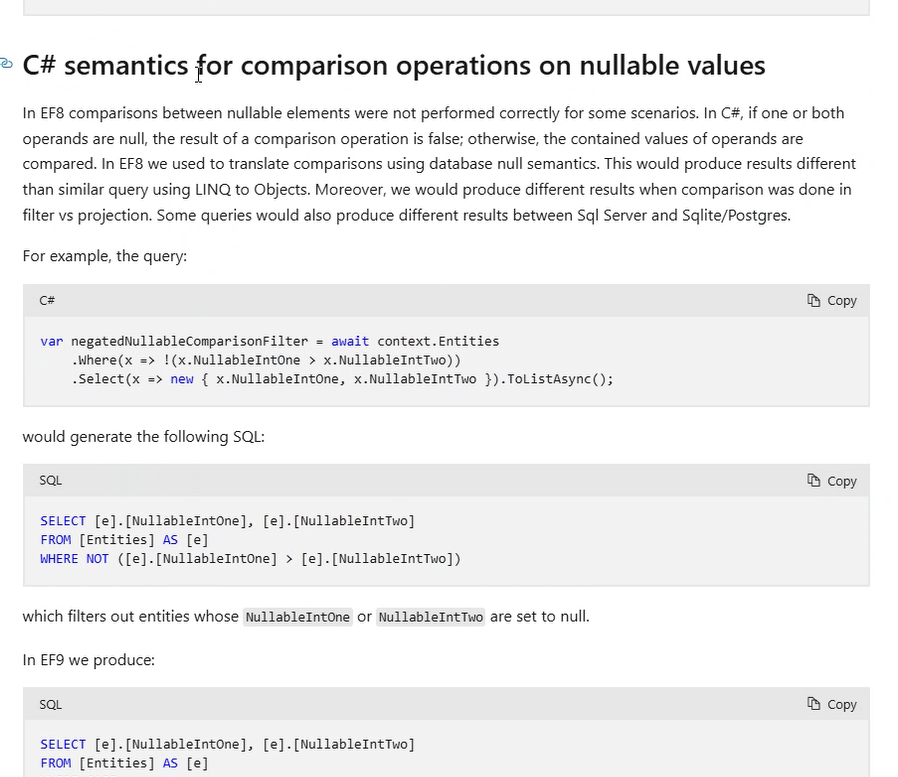

- Case 改用`~`做優化
  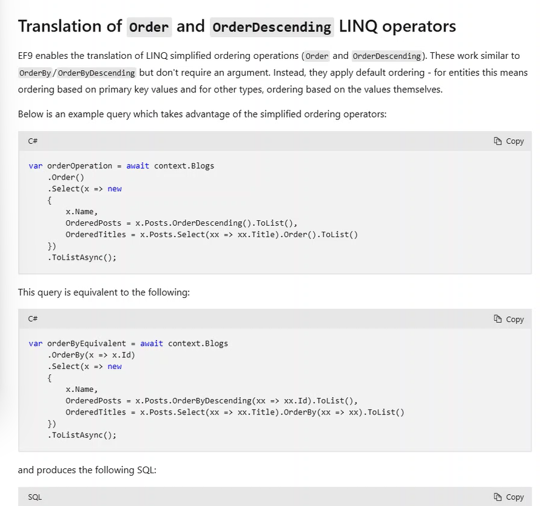

#### Group By

- 支援Group By之後的功能 (如Count, MAX等等)
  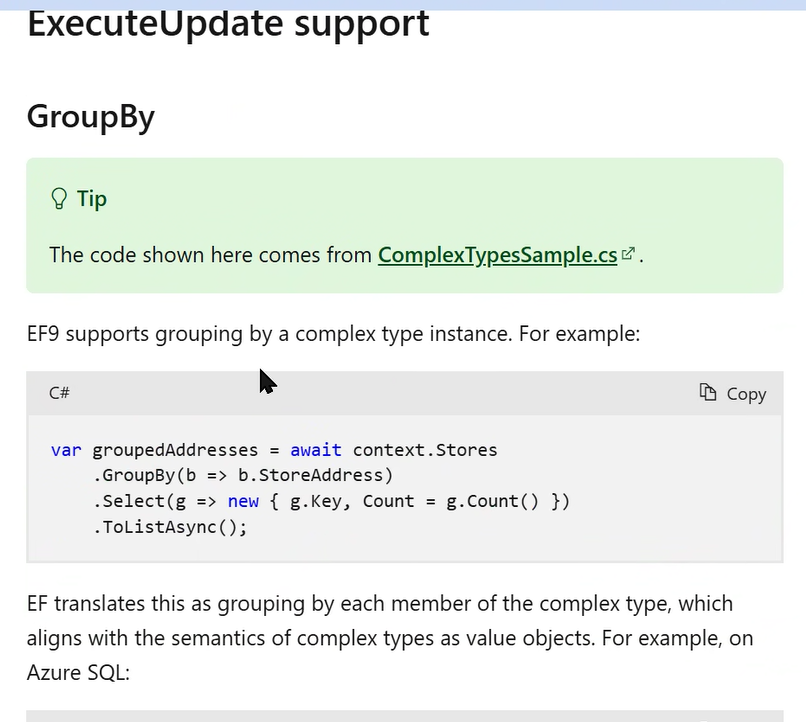

#### ExecuteUpdate

- 支援直接Update複雜操作
  
  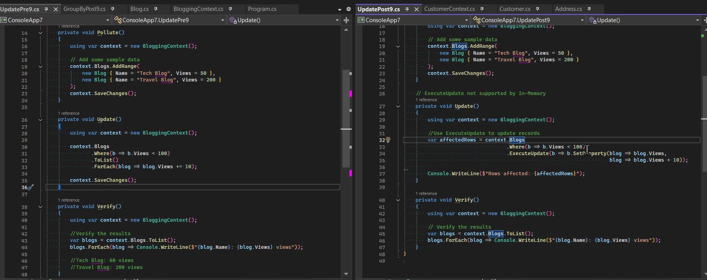

## Model building

### Auto-compiled models

- 開始預設生成Pre-Compiled models
  - 優點: 預先Compile，提升App啟動EF時的速度，尤其對大型專案有效(多type、properties)
  - 用途: Model scanning, compilation, serialization, loading at startup
  - [MSDN - Compiled models](https://learn.microsoft.com/en-us/ef/core/performance/advanced-performance-topics?tabs=with-di%2Cexpression-api-with-constant#compiled-models)
  - 原始手動指令:

    ```Bash
    dotnet ef dbcontext optimize
    ```

    - Run CMD後，還要根據指示在Configuration添加`.UseModel(MyCompiledModels.XXXContextModel.Instance)`
    

    

### MSBuild integration

- 上述Pre-compiled model需要安裝`Microsoft.EntityFrameworkCore.Tasks`
- 並在`.csproj`當中設定

  ```XML
  <PropertyGroup>
      <EFOptimizeContext>true</EFOptimizeContext>
      <EFScaffoldModelStage>build</EFScaffoldModelStage>
  </PropertyGroup>
  ```

- Build成功後顯示Optimizing DbContext
    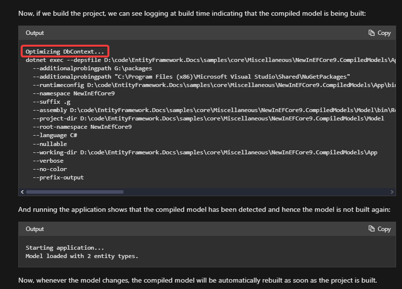


### Read-only primitive collections

- 開始支援Read-only primitive collections
  - Primitive collections 始於[EF 8](https://learn.microsoft.com/en-us/ef/core/what-is-new/ef-core-8.0/whatsnew#primitive-collections)，可將簡單型別以JSON儲存於DB Column (`numeric`, `bool`, `string`, `date`, `enum`, `Uri`...)

  ```C#
  // Entity model
  public class PrimitiveCollections
  {
      public IEnumerable<int> Ints { get; set; }
      public ICollection<string> Strings { get; set; }
      public IList<DateOnly> Dates { get; set; }
      public uint[] UnsignedInts { get; set; }
      public List<bool> Booleans { get; set; }
      public List<Uri> Urls { get; set; }
  }
  ```

  ```C#
  // Configuration
  modelBuilder
    .Entity<PrimitiveCollections>()
    .Property(e => e.Booleans)
    .HasMaxLength(1024)
    .IsUnicode(false);
  ```

- 實際應用: LINQ將產生json處理的相關SQL

    


### Specify fill-factor for keys and indexes

- Primary Key & Index開始支援Fill factor
  - Fill factor: 可手動設定Index page的"初始"使用率
    - Index page為index儲存的單位 (大小固定為8kb=8096字節)
    - Fill factor原始為100%，如降低可減少Page splits的狀況
    - 詳細參考[MSDN](https://learn.microsoft.com/en-us/sql/relational-databases/indexes/specify-fill-factor-for-an-index?view=sql-server-ver16)
    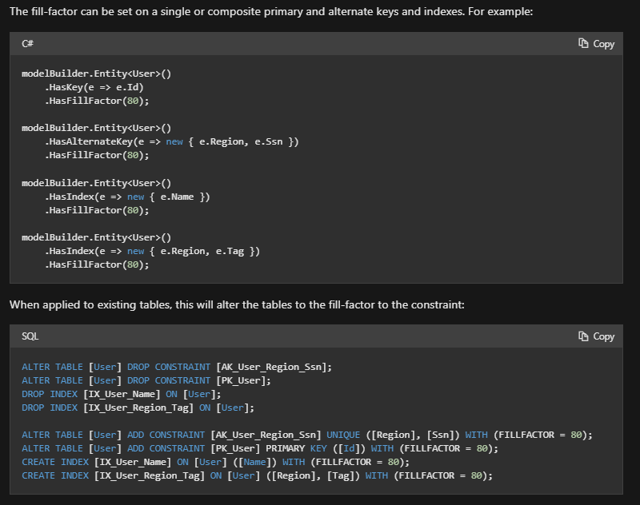

### Make existing model building conventions more extensible

- [Model building conventions](https://learn.microsoft.com/en-us/ef/core/what-is-new/ef-core-7.0/whatsnew#model-building-conventions): EF自動偵測與設定model的convention，能允許再被客製化 (比如設定所有entity的string column max length為500)
  - [MSDN](https://learn.microsoft.com/en-us/ef/core/modeling/bulk-configuration#conventions): 詳細Convention使用範例
- 擴充若干Convention的方法
  - 官方[舉例](https://github.com/dotnet/EntityFramework.Docs/blob/main/samples/core/Miscellaneous/NewInEFCore9/CustomConventionsSample.cs): 客製化`PropertyDiscoveryConvention`識別自定義 `Persist` attribute的設定簡化
    
    - EF 9以前:
    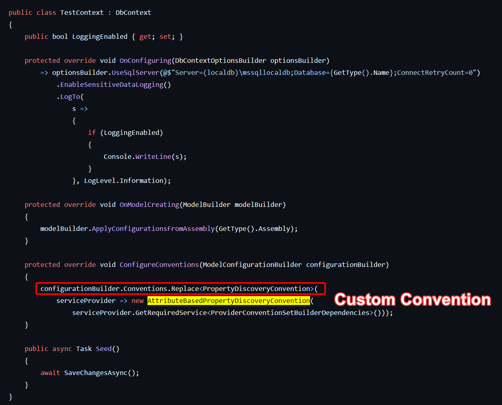
    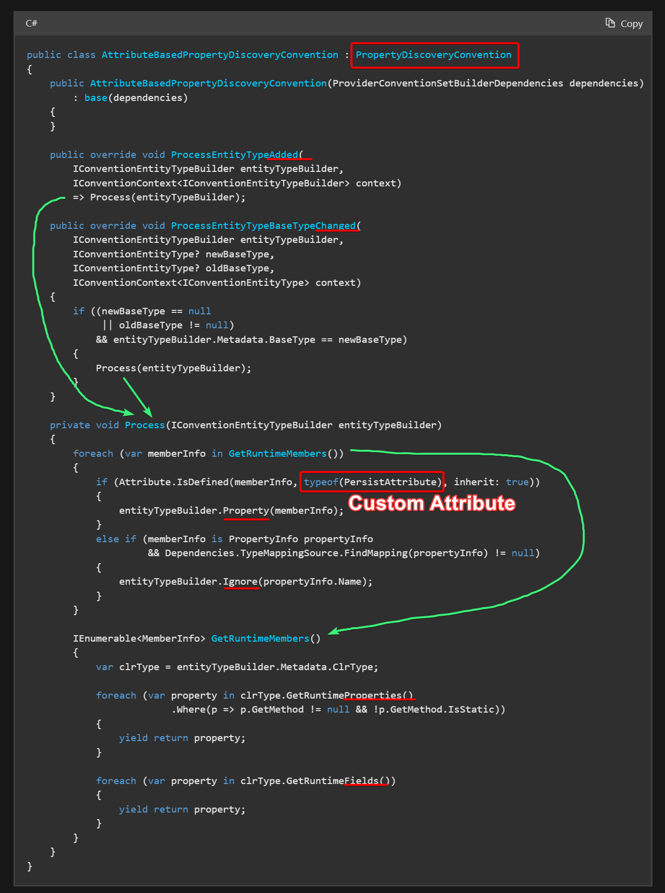
    - EF 9以後: 新增`PropertyDiscoveryConvention.IsCandidatePrimitiveProperty`
    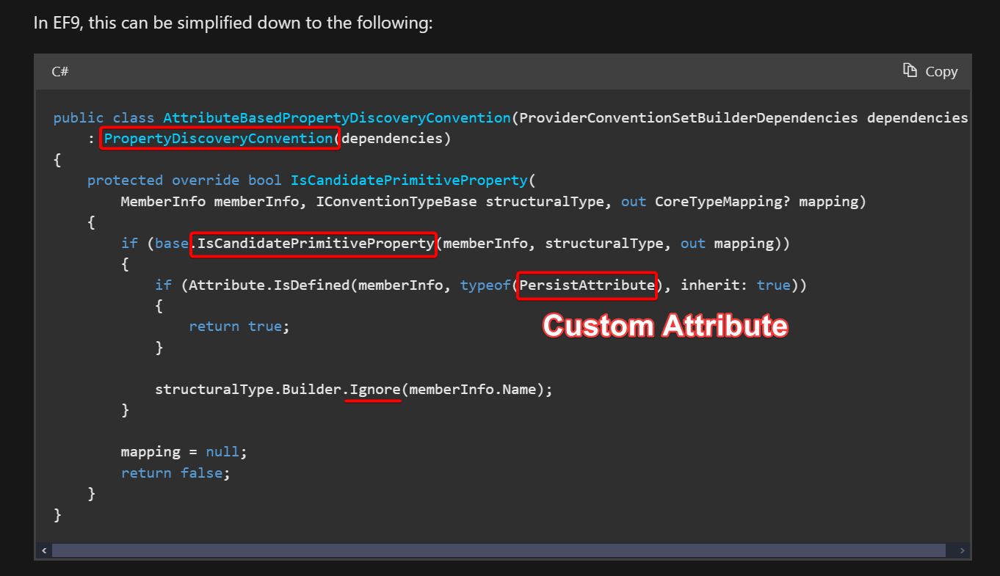
    - 其他`PropertyDiscoveryConvention`的擴充functions
    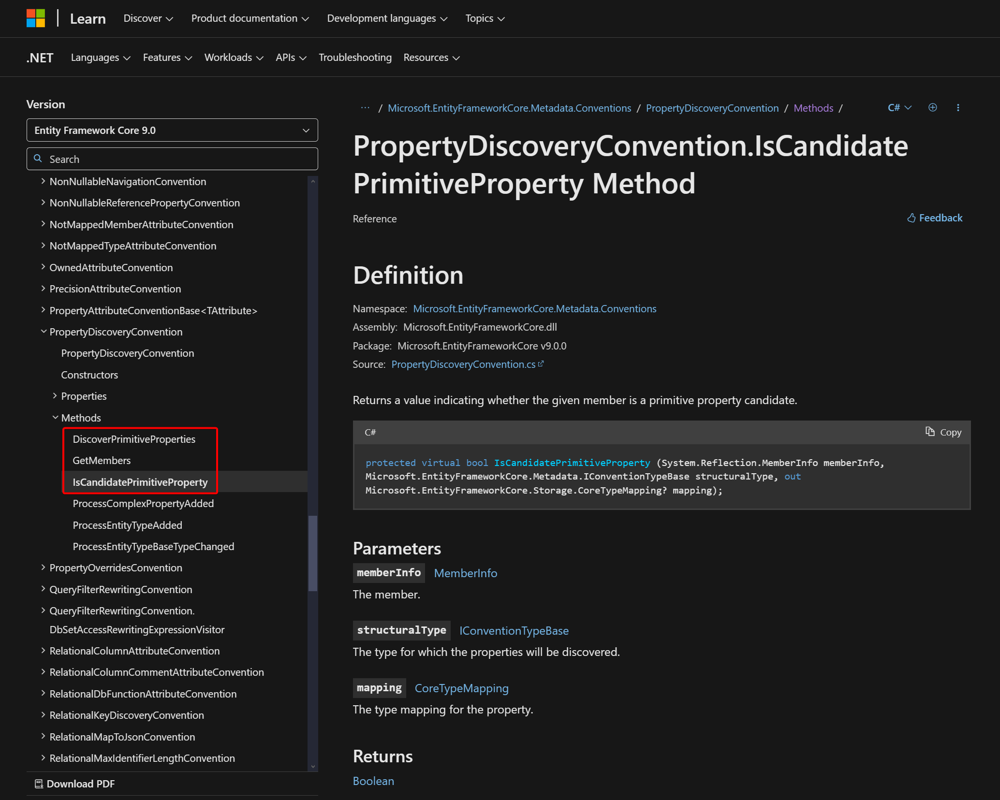

### Update ApplyConfigurationsFromAssembly to call non-public constructors

- Implement IEntityTypeConfiguration擴充constructor條件
- 用途舉例: 繼承class呼叫parent protected constructor
    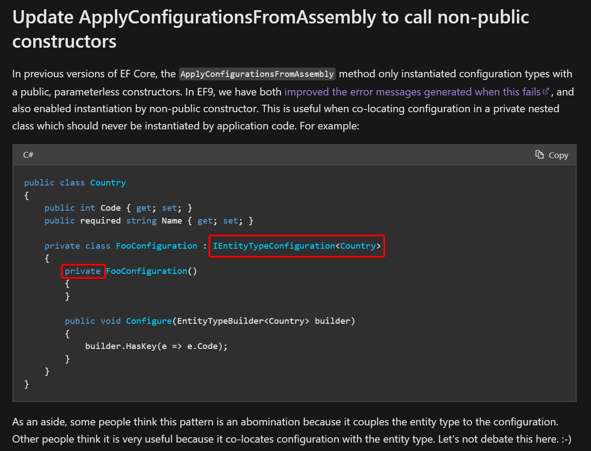
