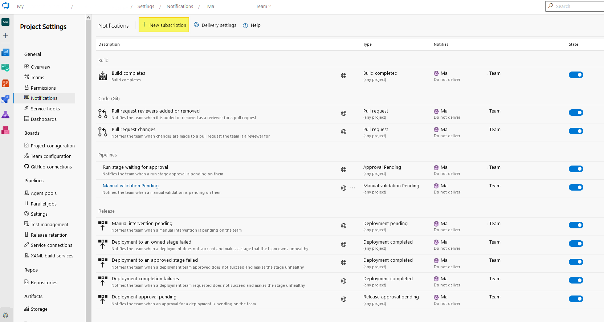
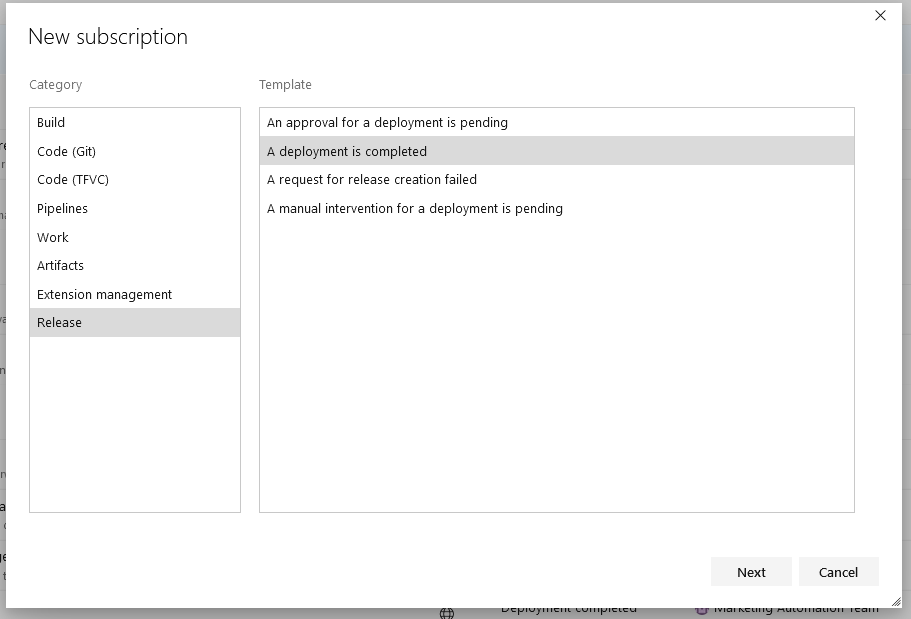
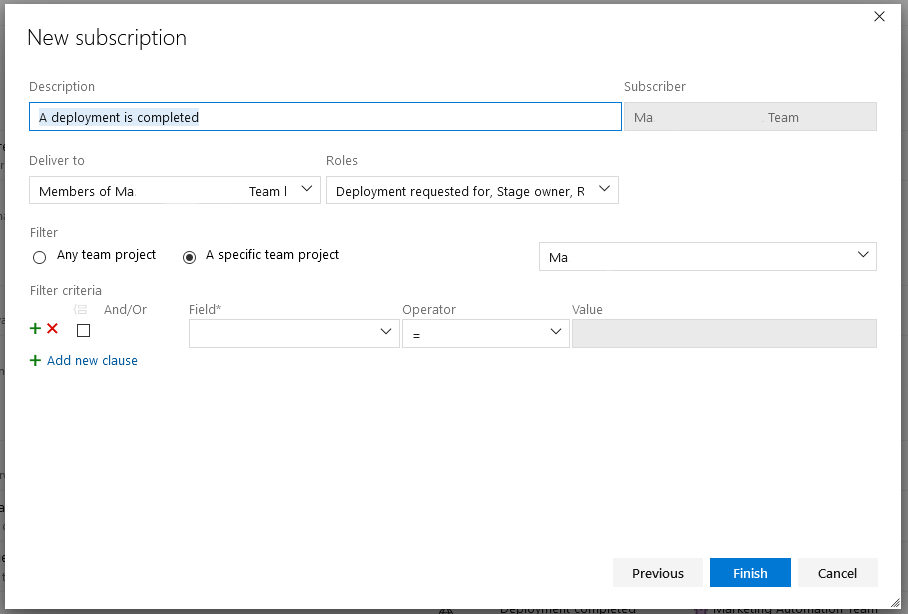
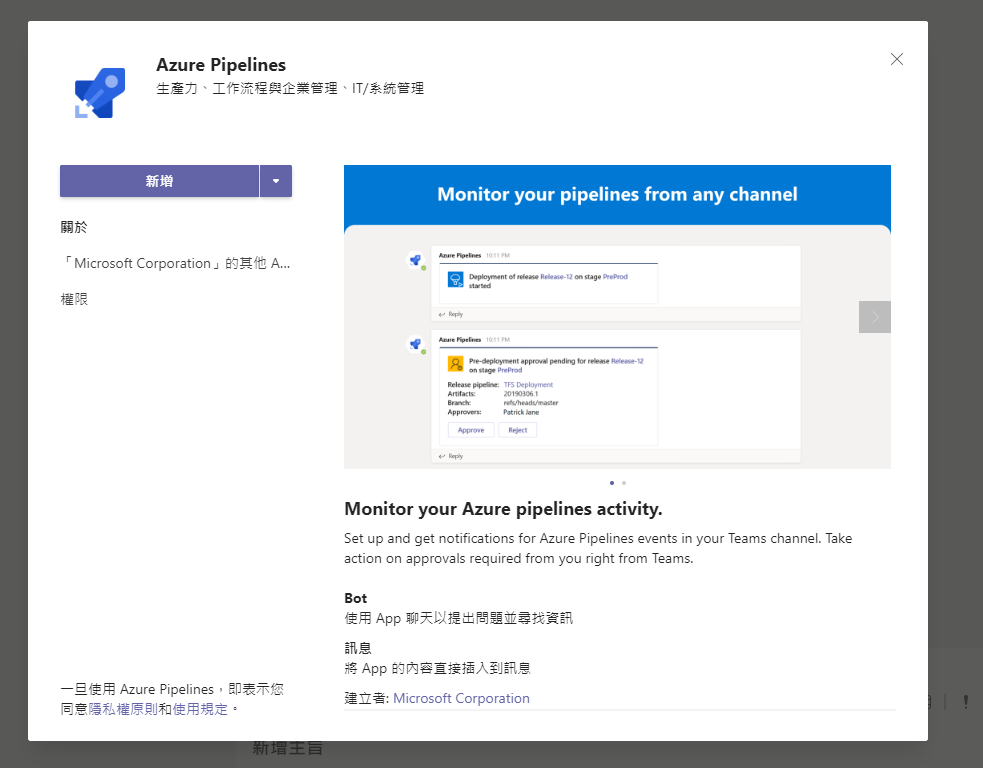
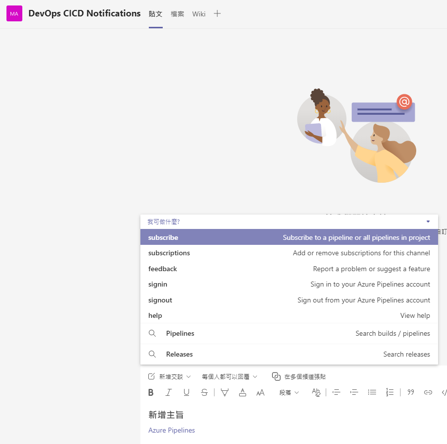
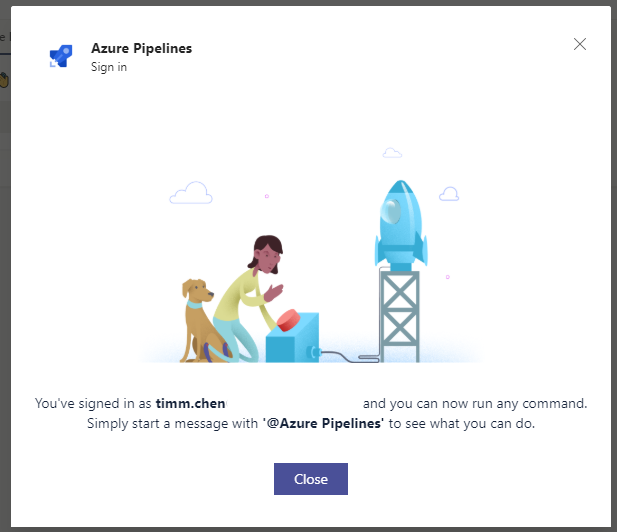
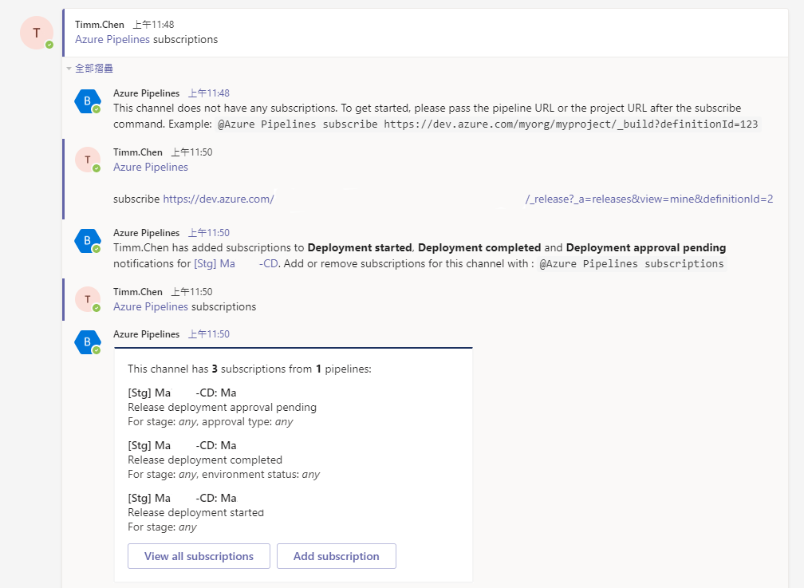
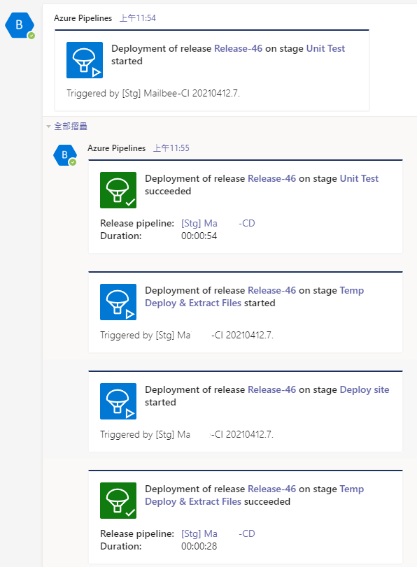
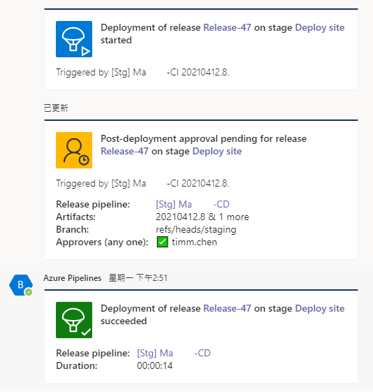

## 設定Pipeline通知 [↩](CICD%E8%A9%B3%E7%B4%B0%E6%B5%81%E7%A8%8B%E7%AD%86%E8%A8%98.md)

### • 設定Email通知
1. 在Project左下角點Project setting，進入設定畫面
   

2. 開啟Notification，新增New subscription
   

3. 自選要通知的類別
   

4. 設定要收到的人、發送條件等，即可發送通知信
   

### • 設定Teams通知
1. 參考安裝流程，到MS下載頁面下載Teams的Pipelines插件
2. Teams中會出現DevOps的安裝通知
   

3. 除直接新增外，下拉也可以選擇幫整個團隊 & 頻道做設定
   

4. 接下來在交談中就可以藉由輸入@azure pipelines的方式去使用相關功能
    

5. 第一次使用需要做登入
   

6. 可查詢現在頻道有綁定的通知訂閱 & 新增或移除綁定 (語法參考MSDN)
   

7. 綁定Subscription成功後，即可在Teams中得到即時的Pipelines資訊 (包含簽核)
   

設定簽核的Stage的部分
   

#### [Back to Steps](CICD%E8%A9%B3%E7%B4%B0%E6%B5%81%E7%A8%8B%E7%AD%86%E8%A8%98.md)