# PowerBI

## DataSet

* ### 更改資料源
  * Table Edit Query</br>
  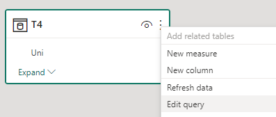</br>
  * Edit Source</br>
  </br>
  * Advanced Editor (可用語法強制切換)
  </br>

* ### Transform 資料轉換
  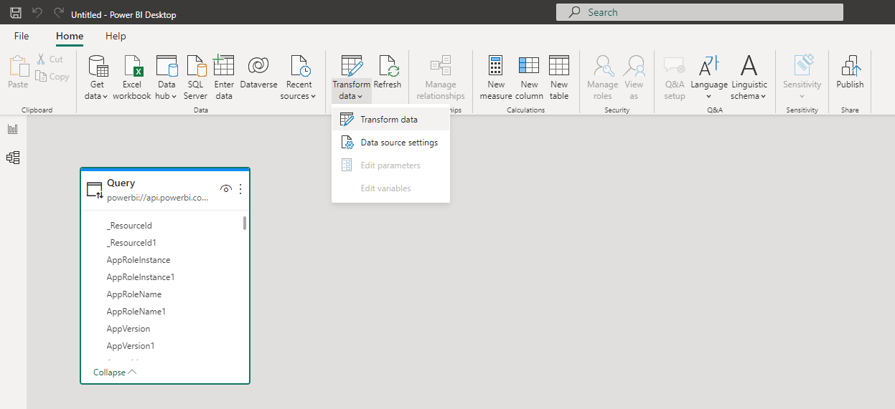</br>
  * 適用Join多個Column時，合併某幾個Column (用&分隔，語法為Power Query Language，參考[這裡](https://excelquick.com/excel-power-query/power-query-concatenate-text-and-numeric-data/))
  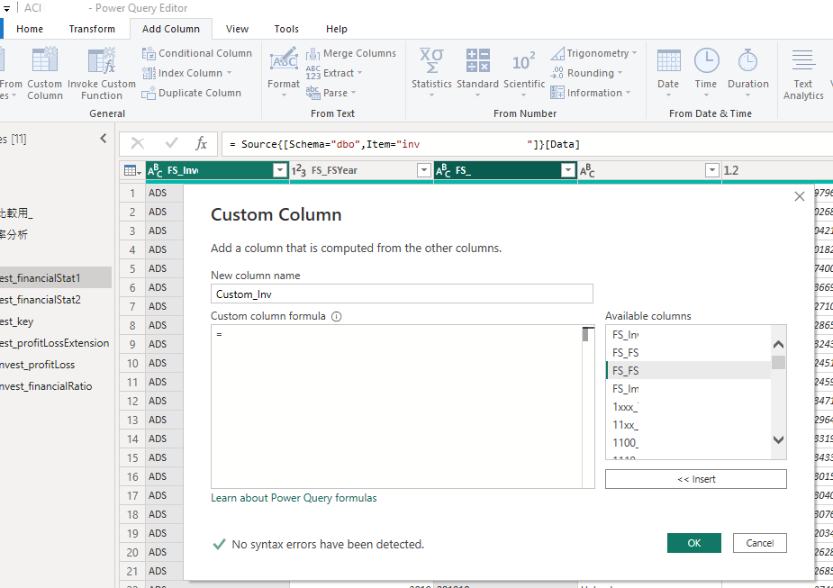</br>

#### 資料清理

* Replace Error (右鍵有問題的Column → Replace Error)
  
* 使用第一個資料列為標頭
  </br>

* ### Join (Relationship)

  #### Model View
  * 直接在Model View當中拖曳兩個Table的欄位在一起
  * 如果不是一對一或一對多關係，則會跳出相關設定
  * 多個Column要Join的話需要先用Transform做前處理
    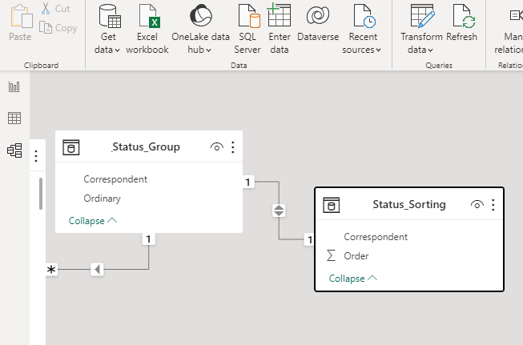</br>

  #### Merge Query (New Table)

  1. Combine >> Merge Queries with new table
    </br>

  2. 選左右表、Column選Join columns，確定後新增表
    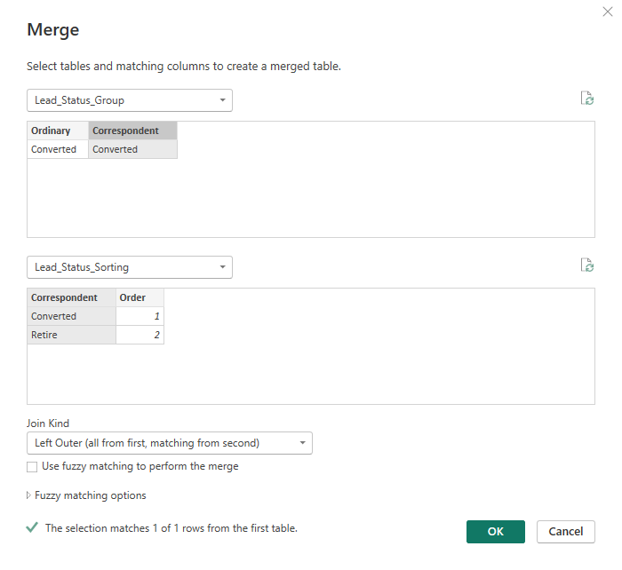</br>

  3. 更新Table name、最右側會摺疊起來右表，點選Col header下拉展開 (可以把join column移除)，即完成!
    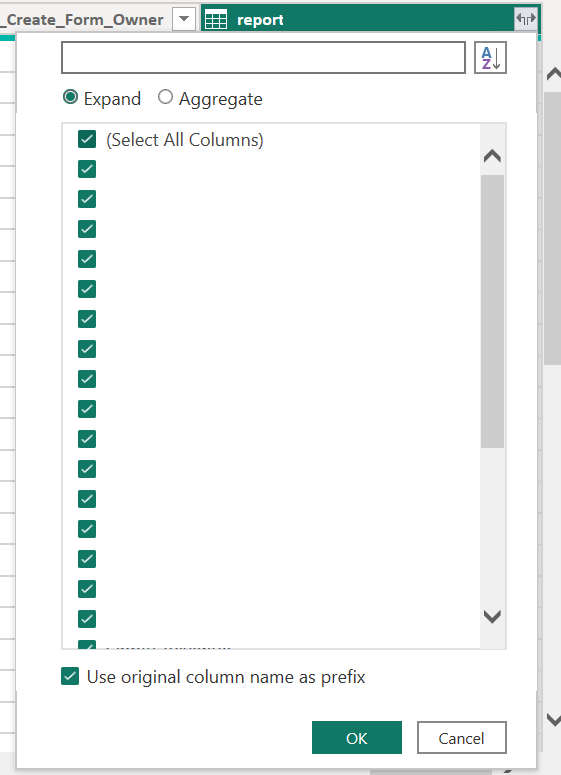</br>

* Column別名

  * 右鍵直接Rename即可</br>
    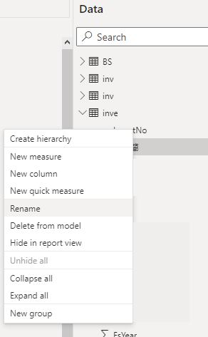
  * 也可以在圖片上右鍵只Rename這個visual的colum name
    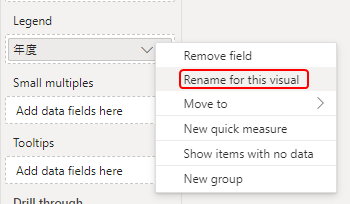

  * 需要查詢Column原名，在Edit Query可以看到自動產生的DAX別名語法</br>
    </br>
    </br>

* ### 欄位格式
  * 點選欄位後，上方Format可選
    </br>

#### Enter Data

1. 新增Table: Enter Data
2. 輸入Table name, Columns, Rows，完成後按Save
3. 如後續要更改資料，可以點左側的齒輪，進入到編輯模式
  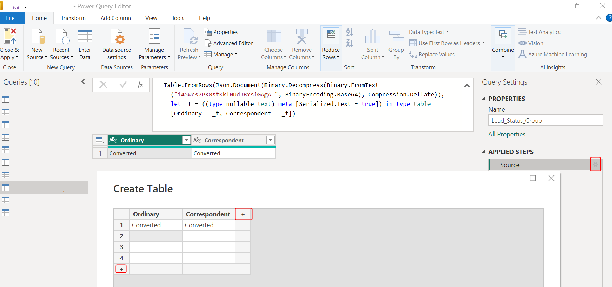</br>

#### Measures

1. 新增Table統一納管: Enter data
  </br>

2. 於新Table，New Measure
  </br>

3. 等號左邊為Measure名稱，右邊為DAX語法 (如加總、判斷式、COUNT等)
  </br>


## 圖表

* ### 將不同Column合併繪圖(自製X、Y軸圖表)
  0. 準備欲混合的參照表Columns (ORI_TABLE.TARGET_COLUMN_1、ORI_TABLE.TARGET_COLUMN_2)
  1. 新增表: Enter Data (Table name: NEW_TABLE)
  2. 新增圖表X軸資料: 新增一個Column (X_AXIS)，包含所有長條圖的自定義X軸名稱 (COLUMN1、COLUMN2)
  3. 合併兩個圓表的Column: 新增Measure，輸入`IF(SELECTEDVALUE('NEW_TABLE'[X_ASIX])="COLUMN1", 'ORI_TABLE'[TARGET_COLUMN_1], 'ORI_TABLE'[TARGET_COLUMN_2])`
  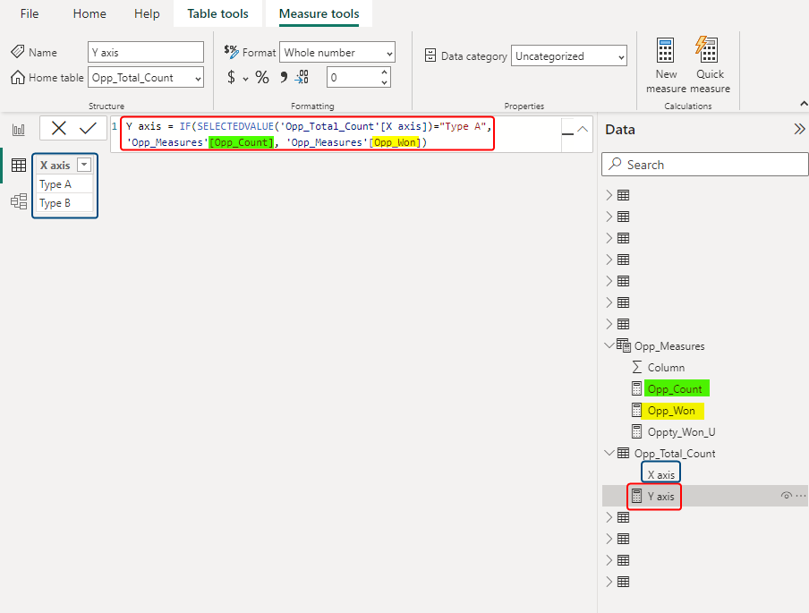</br>
  4. 圖表結果: COLUMN1只抓TARGET_COLUMN_1的值，COLUMN2只抓TARGET_COLUMN_2的值 (把兩個原本的Column都各自畫在一個Bar上)
  </br>


* ### 計數、加總
  </br>
* Expand功能 (需要能折疊Drill的欄位型別)
  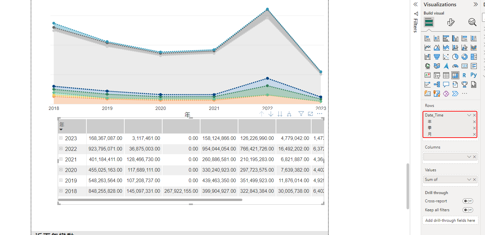</br>
  </br>

* ### Filter

* 移除空白圖例：Filter點選圖例Column，全選後移除"(空白)"
  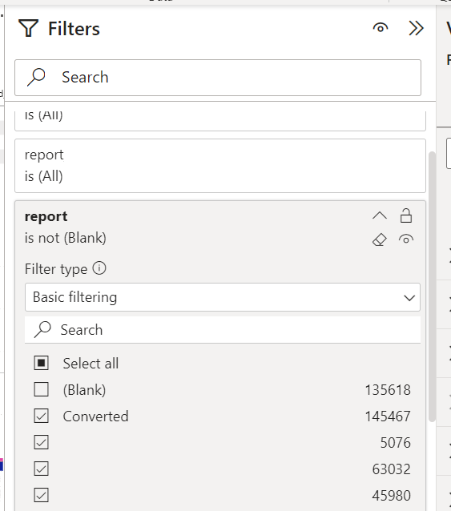</br>

  * 特定表格取消篩選 (點右上角圓圈叉叉可以讓該表不用套用)

* ### Group

1. 新增分類表，Column 1為原值，Column 2為分類名稱 (Enter Data)
  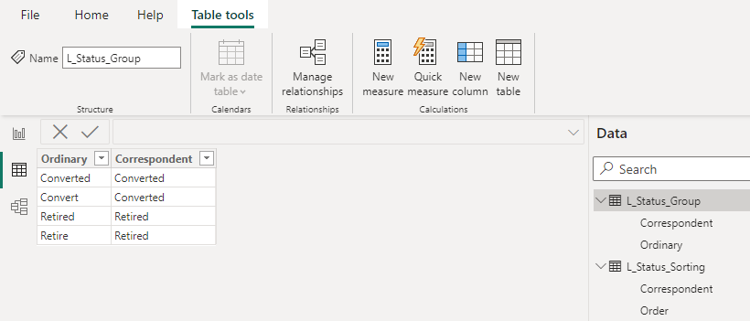</br>
2. 新增排序表，將Column 2的分類名稱，以Column 3新增數字排列
  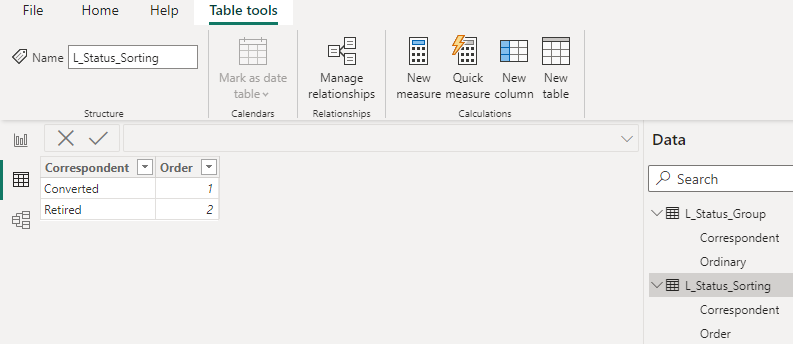</br>
3. 新增Matrix，將Values指定你要的、Rows或Columns指定為排序表的Column 2 (分組名稱)
4. 分組排序: 到Data View，將排序表的Column 3選為排序Column
  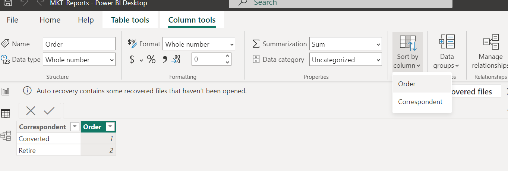</br>

* ### Visualization

* Title、XY軸的Title
* 調整圖例位置、標題
  
  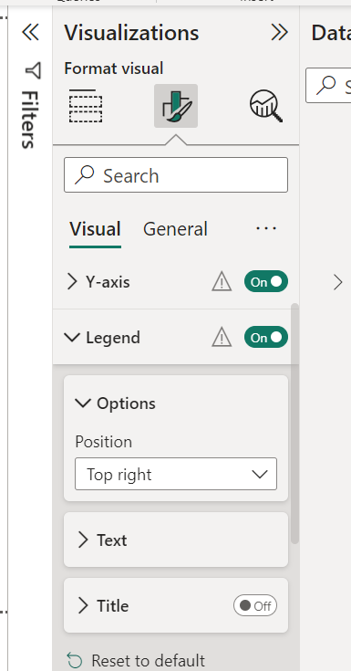</br>

* 調整線條/圖例顏色：Lines → Colors
* 調整長條/圖例顏色：Columns → Colors
  
  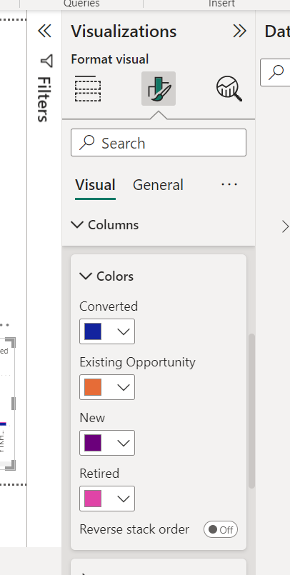</br>

* 畫布設定→背景長寬

* Specific Column → 可個別調整顏色、字型、大小、單位等等

* Row Headers → +/- icons 可以開關展開按鈕 (如日期)

* ### Layout

* 合併不同Reports到同一個畫面

## Pro

### Workspace

* 只有PowerBI Pro才能使用，能由Admin指派權限給Users
* 作為Publish與儲存pbix檔案的媒介 (線上版的檔案即為Desktop版publish後的版本)
* 可線上編輯 (立即Publish)

### DataSet

* 設定權限、Scheduled refresh等等
  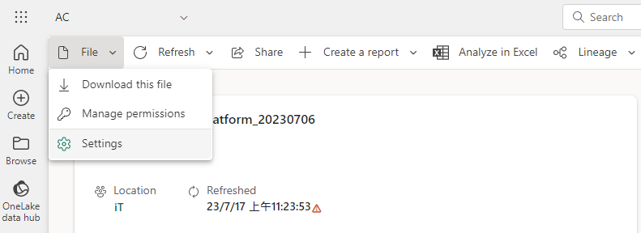

* Azure DB須設定Credentials
  
  
  * Azure端要將解除限制的選項打勾
    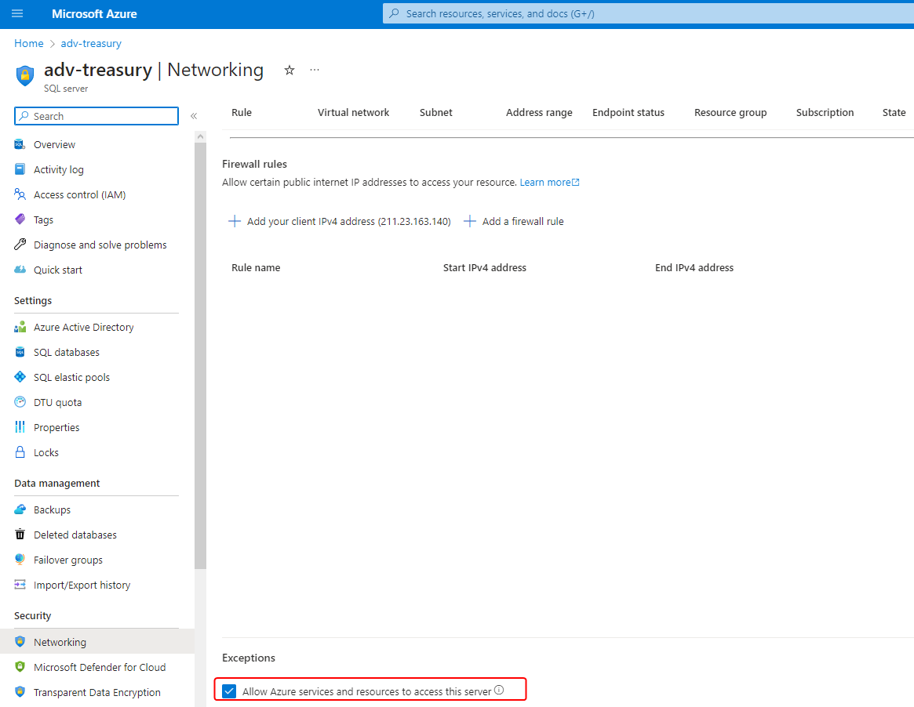

### SharePoint整合

* 參考[官方文件](https://learn.microsoft.com/en-us/power-bi/connect-data/refresh-desktop-file-onedrive)，可由Share point (Teams)匯入檔案，之後"DataSet"檔案更新也會同步refresh到workspace (缺點是Publish時會出現失敗的狀況)

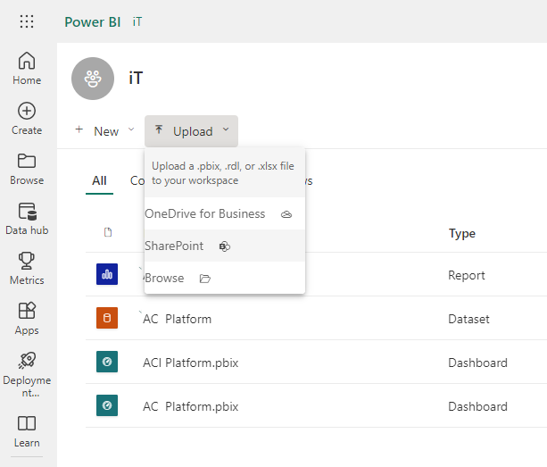</br>
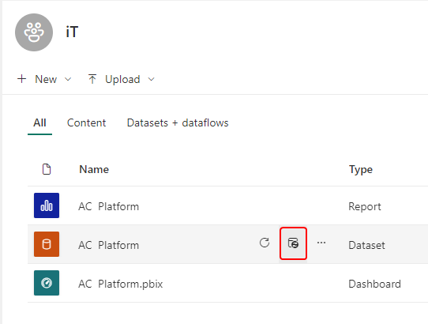</br>

### Embedded

* 內嵌Report輸出
  </br>

* 設置Role給予不同資料觀看權限
  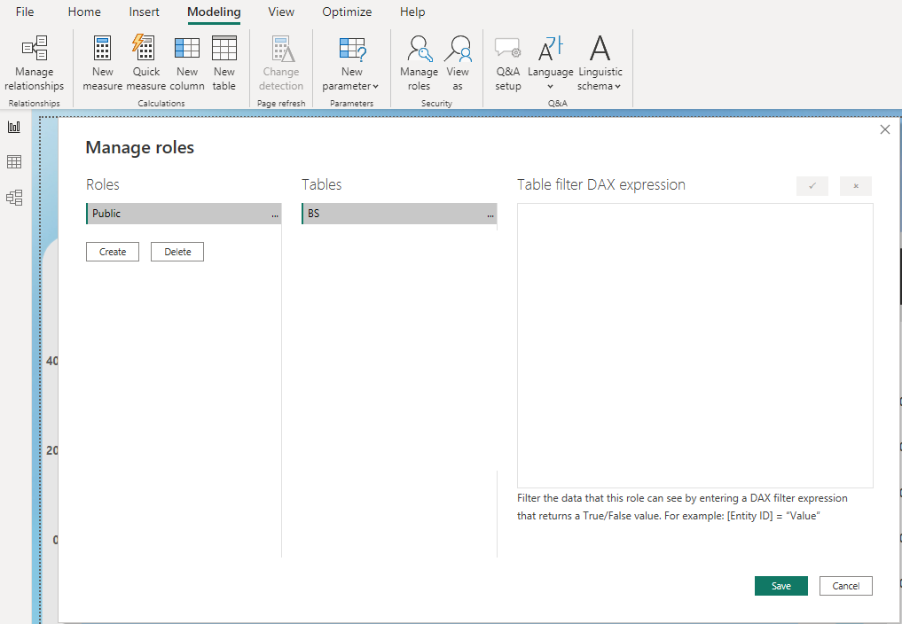</br>

* 內嵌於自有平台，參考[官方文件](https://learn.microsoft.com/zh-tw/power-bi/developer/embedded/embed-organization-app)
  1. 新增embed.js檔案，並填入官方提供的js語法

     ```js
     // 這邊的function也可以改成一般的function，在目標頁面再行呼叫即可(View model也可以用parameter傳入)
     $(function(){
        // 1 - Get DOM object for div that is report container
        let reportContainer = document.getElementById("embed-container");

        // 2 - Get report embedding data from view model
        let reportId = window.viewModel.reportId; // <- 注意在呼叫此檔案前要先宣告好viewModel參數
        let embedUrl = window.viewModel.embedUrl;
        let token = window.viewModel.token
        let reportPageId = "ReportSection" + window.viewModel.pageId;

        // 3 - Embed report using the Power BI JavaScript API.
        let models = window['powerbi-client'].models;
        let isMobile = window.innerWidth < 1200;
        let config = {
            type: 'report',
            viewMode: models.ViewMode.View,
            //tokenType: models.TokenType.Aad,  // <-使用原文件的Aad參數可能會出現403問題!
            tokenType: models.TokenType.Embed,
            permissions: models.Permissions.All,
            accessToken: token,
            embedUrl: embedUrl,
            id: reportId,
            pageName: reportPageId, // 一個report有多個頁籤，這邊可指定(格式為ReportSectionXXX，可在PowerBI Pro cloud上面點開該頁籤，其ID會顯示於URL)
            settings: {
                panes: {
                    filters: { expanded: false, visible: true }, // <- 控制右側的Filter面板
                    pageNavigation: { visible: false }
                },
                layoutType: isMobile ?
                models.LayoutType.MobilePortrait : models.LayoutType.Master // <-可根據初始window寬度決定是否要顯示手機板版面
            },
            filters: [
            { // 以下可設定由網頁丟入values進行篩選，相當於PowerBI當中的Filter儀錶板
                $schema: "http://powerbi.com/product/schema#basic",
                target: {
                    table: "myTable",
                    column: "myColumn"
                },
                operator: "In",
                values: ["keyword1", "keyword2"],
                filterType: models.FilterType.BasicFilter,
                requireSingleSelection: true
            }
        ]
        };

        // Embed the report and display it within the div container.
        let report = powerbi.embed(reportContainer, config);

        // 4 - Add logic to resize embed container on window resize event
        // 這邊是控制Loading時Report高度的邏輯 (預設會根據網頁的高度做調整)
        let heightBuffer = 12;
        let newHeight = $(window).height() - ($("header").height() + heightBuffer);
        $("#embed-container").height(newHeight);
        $(window).resize(function() {
            var newHeight = $(window).height() - ($("header").height() + heightBuffer);
            $("#embed-container").height(newHeight);
        });

        // 自行新增 -> Report讀取完成的邏輯 (取得Report全高)
        // https://learn.microsoft.com/en-us/javascript/api/overview/powerbi/handle-events
        report.on('loaded', function (event) {
          reportPages = report.getPages()
            .then(function (pages) {
                // 有多個頁籤時，需要選到對的那一個
                let targetPage = pages.filter(function (page) {
                    return page.name === reportPageId;
                })[0];

                let innerReportHeight = targetPage.defaultSize.height;
                let innerReportWidth = targetPage.defaultSize.width;
                if (isMobile && targetPage.mobileSize != null) {
                    // Mobile的長寬設定不一樣
                    innerReportHeight = pages[0].mobileSize.height;
                    innerReportWidth = pages[0].mobileSize.width;
                }
                var scalledInnerReportHeight = innerReportHeight / innerReportWidth * reportContainer.clientWidth;  // 等比例放大
                reportContainer.style.height = scalledInnerReportHeight + "px";
            });
        });
      });
     ```

  2. 根據官方文件，在欲嵌入的cshtml檔案中填入以下Razor語法

    ```html
    @model UserOwnsData.Services.EmbeddedReportViewModel;

    <div id="embed-container" style="height:800px;"></div>

    @section Scripts {

        <!-- powerbi.min.js is the JavaScript file that loads the client-side Power BI JavaScript API library.
        Make sure that you're working with the latest library version.
        You can check the latest library available in https://cdnjs.com/libraries/powerbi-client -->
        <script src="https://cdn.jsdelivr.net/npm/powerbi-client@2.21.0/dist/powerbi.min.js"></script>

        <!-- This script creates a JavaScript object named viewModel which is accessible to the JavaScript code in embed.js. -->
        <script> 
            var viewModel = {
                reportId: "@Model.Id",
                embedUrl: "@Model.EmbedUrl",
                token: "@Model.Token"
            }; 
        </script>

        <!-- This script specifies the location of the embed.js file -->
        <script src="~/js/embed.js"></script>
    }
    ```

    * 或可使用Javascript方便共用 (JQuery為例)
  
    ```html
    <!-- powerbi.min.js is the JavaScript file that loads the client-side Power BI JavaScript API library.
    Make sure that you're working with the latest library version.
    You can check the latest library available in https://cdnjs.com/libraries/powerbi-client -->
    <script src="https://cdn.jsdelivr.net/npm/powerbi-client@2.21.0/dist/powerbi.min.js"></script>

    <!-- This script creates a JavaScript object named viewModel which is accessible to the JavaScript code in embed.js. -->
    <script>
        var viewModel = {};
        $.holdReady(true);  // 避免後面PowerBI js檔案先跑embed report
        $.ajax({
            type: "POST",
            url: "URL_TO_GET_REPORT_CONFIG",
            data: { reportId: "..." },
            success: function (data) {
                // 這邊的參數要跟embed.js的參數一致
                viewModel = {
                    reportId: data.reportId,
                    embedUrl: data.embedUrl,
                    token: data.token
                };
            },
            error: function () {
                alert("Get report config  failed.");
            },
            complete: function () {
                $.holdReady(false); // 讓下方embed.js繼續跑
            }
        });
    </script>

    <!-- This script specifies the location of the embed.js file -->
    <script src="~/js/embed.js"></script>
    ```
