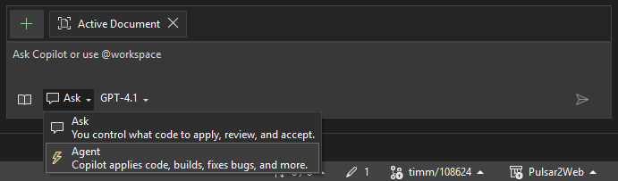
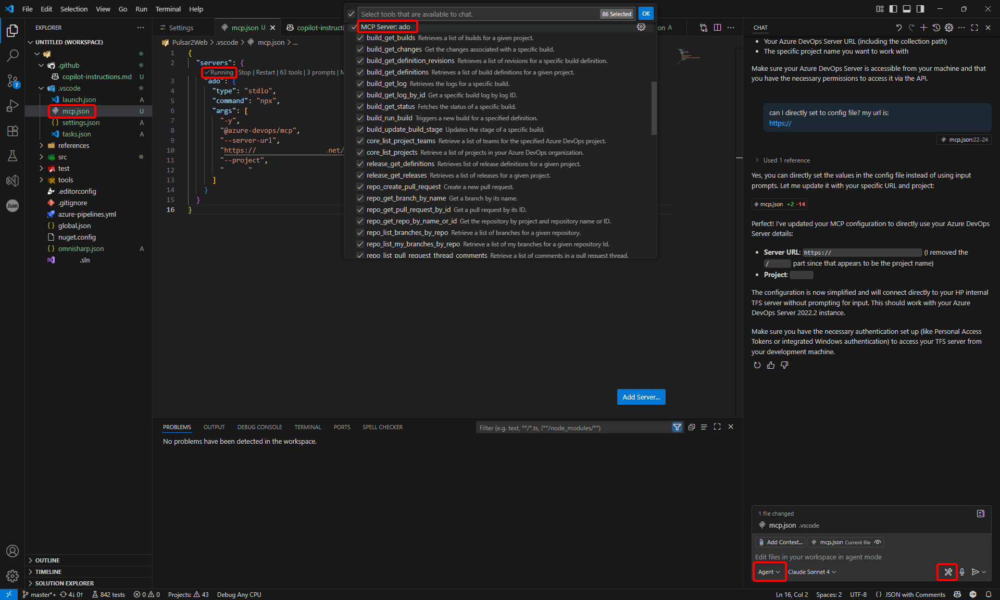
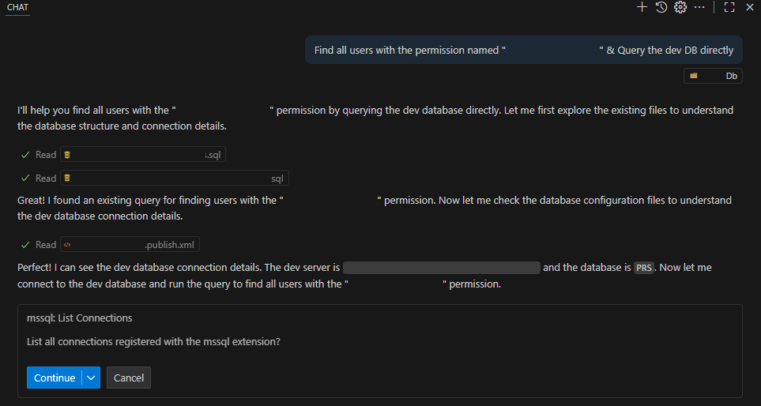
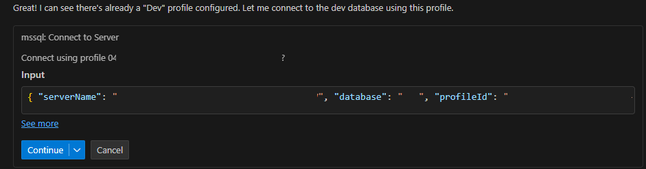
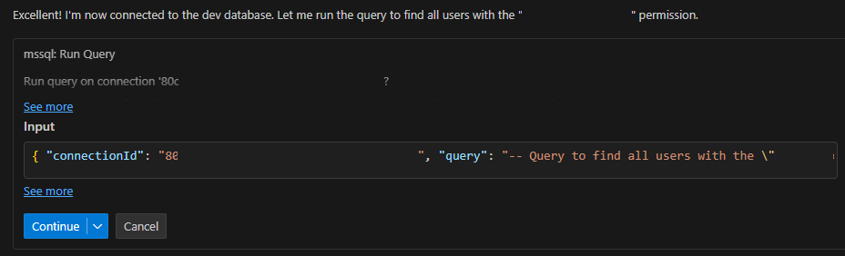
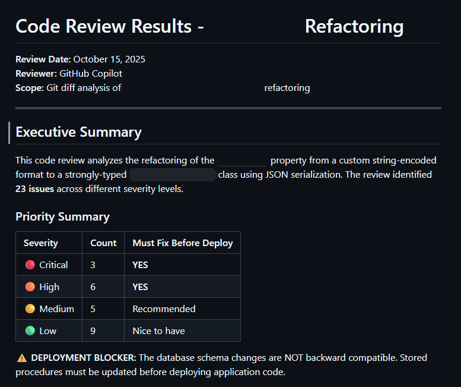

# AI Tools

- [AI Tools](#ai-tools)
  - [Bing Search](#bing-search)
  - [Github Copilot](#github-copilot)
    - [Agent Mode](#agent-mode)
    - [Instructions](#instructions)
    - [MCP Server](#mcp-server)
- [AI Development心得](#ai-development心得)
  - [基本用法](#基本用法)
  - [進階用法](#進階用法)
  - [創意用法](#創意用法)
  - [注意事項](#注意事項)


## Bing Search

## Github Copilot

- #copilotCodingAgent -> 外包另一個github cloud背景Agent去跑、現在的Agent可以繼續作用
- Prompts\xxx.prompt -> 多個.prompt檔案可以在VS Code右上角去Run prompt (icon)
- Copilot spaces -> 公司層級儲存project特定的custom instructions

### Agent Mode

- 提供專案層級的協助，並且能夠進行檔案編輯、CMD授權執行、API執行的



### Instructions

- 提供自定義AI指示，提供如code style/rule/exception等等
- 置於.github directory當中，命名`copilot-instructions.md`
- 官方範例: [Adding repository custom instructions for GitHub Copilot](https://docs.github.com/en/copilot/how-tos/configure-custom-instructions/add-repository-instructions)

### MCP Server

- VS Code設定
  - 置於.vscode directory當中
  - 範例: 執行自製.net MCP執行檔
    - 此方法需要自行build或publish to .exe執行檔，並給VS Code做啟動
    - 不建議用VS Code直接針對.sln或.csproj進行直接Build，這會導致主專案與MCP專案的執行衝突

  ```json
  {
    "servers": {
      "my-ado-mcp": {
        "type": "stdio",
        "command": "C:\\PATH_TO_DIR\\my-ado-mcp\\bin\\Debug\\net10.0\\my-ado-mcp.exe",
        "args": [],
        "env": {
          "ADO_SERVER_URL": "https://MY-ADO-DOMAIN/MY-ORG/",
          "ADO_DEFAULT_PROJECT": "MY_PROJ",
          "ADO_USE_WINDOWS_AUTH": "true"
        }
      }
    }
  }
  ```

- Azure DevOps (Code base / Board / Wiki / PR...)
  - 可讀取案件、Code、Wiki等等額外資訊提供Copilot
  - Use case: 取得Board Task內容，直接對現有專案進行應用、建議
  - 亮點: 可直接讓AI跟專案進行關聯
  

- Git change code review
  - 可以分析uncommit / committed changes
  - 可以用git command進行分析 (比如merge branch)前的code change review
    - Techniques suggestion (Structure, script)
    - Code style check
    - Find bug
    - Case Requirement check
  - Use case: 可搭配上方ADO MCP進行Task description比對與檢查
  - 亮點: 

- Database query (With mssql extension)
  - 需要安裝以下Extension
    - `ms-mssql.mssql` 提供連線DB & Query功能
    - `ms-mssql.sql-database-projects-vscode` 提供SQL Database project讀取
  - 提供內建MCP，給予Github copilot取得Extension的連線資訊、Query權限等
  - 亮點: 針對Query結果進行分析、分類與繪表
  
  
  

- Playwright (Browser)
  - 提供Copilot網頁操作、爬蟲能力
  - Use case: 提供測試流程、簡單page資訊等，讓AI幫忙自動化完成爬蟲腳本

# AI Development心得

## 基本用法

- Explain
- Create tests (Test name & Case列舉尤其強)
- Mimic the behavior
- 檢查程式邏輯漏洞、漏掉Property等

## 進階用法

- 結合Git，做案件Code Review、比較Branch差異等
  - 
- 搜尋跨專案與檔案的Dependencies (前端與弱型別尤其有效)
- 搜尋類似或重複的功能，與提供建議或整理差異
- 配合MCP，將案件與專案進行關聯，比如Get task detail, Add PR comment & task comment等
- 配合MCP & DB Project，直接Query DB並進行結果彙整與多重搜尋建議
- 產生Test instruction，節省要到哪測試找code所花的時間
- 爬公開架構本身的原始碼，可趁機學習 (比如Middleware底層)
- 分析專案結構與製作Doc Guide (比如哪些模塊在哪裡、用了哪些技術)
  - 手動寫標題 → 給AI自動填入
  - 檢查hyperlink
- 更改同時要求change summary doc，如果有Testing Checklist更是如虎添翼!
- 將想法快速實踐成POC，確認技術可行性 (後續再進行優化)
- 探究SQL語法對於SQL Profiler的效能影響 (比如ISNULL與Index的影響)

## 創意用法

- 預測採坑的後果，避免問題發生時成為BUG
- 考驗它，確認與心中的答案是否相同
- 把SSMS產生的Execution plan輸出成XML，請它讀取分析，解讀成人類看得懂的樣子
- 將目前的改動、發現等等，POST到Board Task當中，給之後的AI快速Resume

## 注意事項

- 複雜問題分開問，一步一步慢慢產出修改才能到位
- 隨時存疑，對結果與建議進行二度考量
- 有時候AI讀到的範圍或Domain沒有考量完整，決策前務必確認
- 避免變懶，先自行思考過後，再請AI來做
- 完成後務必確認程式碼是否有問題，並移除無用的Comment