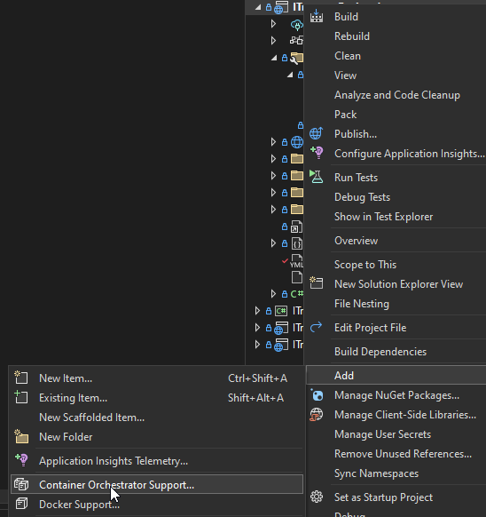
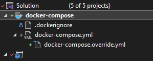
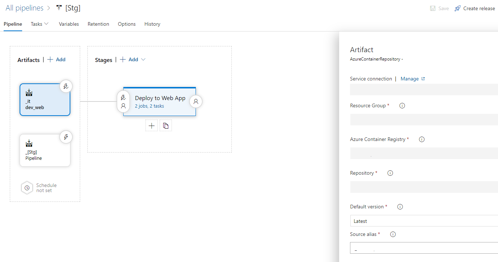
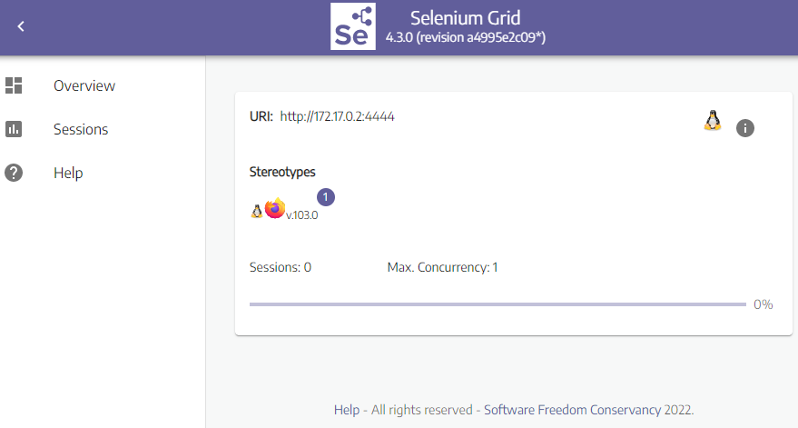

# Container

## Docker

[DockerDesktop](https://www.docker.com/products/docker-desktop/) </br>
[DockerHub](https://hub.docker.com)

```PowerShell
#First, clone a repository
docker run --name repo alpine/git clone https://github.com/docker/getting-started.git
docker cp repo:/git/getting-started/ .

#Now, build the image
cd getting-started
docker build -t docker101tutorial .

#Run your first container
docker run -d -p 80:80 \ --name docker-tutorial docker101tutorial

#Now save and share your image
docker tag docker101tutorial timmchentw/docker101tutorial        
docker push timmchentw/docker101tutorial
```

## Nginx

## IIS

## SQL Server

## Dotnet Core

1. 參考[微軟官方文件](https://docs.microsoft.com/en-us/dotnet/core/docker/build-container?tabs=windows#create-the-dockerfile)說明
2. 新增DockerFile在.csproj資料夾內

    ```docker
    待補充docker指令
    ```

3. 在該路徑下執行Docker Build

    ```docker
    docker build -t IMAEGE_NAME -f Dockerfile .
    ```

    

4. 建立Container

    ```docker
    docker create --name CONTAINER_NAME IMAGE_NAME
    ```

    

5. 如使用Azure Container Registry存放私有Image，可參考微軟官方文件進行佈署
6. 有多個Container同時執行與相依的情況，需額外新增docker-compose.yml

    Ps. 佈署到Azure參考下方方法 </br>
    Ps2. VS支援自動產生docker compose檔案 (可直接在Docker Desktop Debug)
    
    

## Azure Container Registry

用於存放Private Container Images (可與Web App整合)

1. 建立Azure container Registry
2. 使用VS or Pipeline佈署到Azure container Registry
3. 建立Azure Web App or Function (Linux & Docker)
    
4. 建立時直接綁定Azure Container Registry中的Images & Tag
    
5.可直接在Deployment Center直接設定CD、或可之後用Azure pipeline覆蓋設置
    
※ Public image (e.g. DockerHub) 可使用Azure CLI匯入ACR (參考[官方文件](https://docs.microsoft.com/en-us/azure/container-registry/container-registry-import-images?tabs=azure-cli))
※ 清理Image請參考[官方文件](https://docs.microsoft.com/en-us/azure/container-registry/container-registry-auto-purge)

## Azure Pipeline & Web App

1. Docker compose build (Azure Container Registry)
2. Docker compose push (Azure Container Registry)
3. Azure Web App deploy</br>
    ※第一次Run會有Registry & App Service的Permission Approve
    

    ※ Docker Debug資訊參考Diagnose and solve problems (Application Logs→Container Issues)
        
4. 如需將CD拆分成Release pipeline，須注意將docker-compose.yml push到Artifact再取出使用
    
    
</br>
</br>
※ Azure web app對於Docker compose，有一些[未支援的限制](https://docs.microsoft.com/en-us/azure/app-service/configure-custom-container?pivots=container-linux#docker-compose-options):</br>
  (1) Port只能使用最簡單的short syntax

```yaml
services:
  myservice1:
    port:
      # 支援
      '8080:80'

      # 不支援
      #- published: 8080
      #target: 80
      #protocol: tcp
      #mode: host
```

  (2) version要放第一行 </br>
  (3) depends_on會被忽略 </br>
  (4) 所有image只能從同一個registry取得 (如ACR, DockerHub)，不可混用 </br>
  (5) 不支援Merge docker-compose.yml </br>
  ※ 因此使用Docker compose command merge YAML檔(如下方) 的格式，會使得Web App Start失敗

    ```CMD
    docker-compose -d docker.compose.yml -d docker.compose.override.yml config
    ```

## Selenium Grid

1. 參考Selenium Docker (https://github.com/SeleniumHQ/docker-selenium)
2. 使用Docker指令安裝特定瀏覽器與版本

    ```powershell
    docker run -d -p 4444:4444 -p 7900:7900 --shm-size="2g" selenium/standalone-firefox:4.3.0-20220726
    ```

    

3. 進入後台(URL:`http://localhost:4444/ui`)確認Selenium Grid狀態與Session
    
4. 程式端直接使用RemoteDriver連到losthost port 4444，即可調用

    ```C#
     var driver = new RemoteWebDriver(new Uri("http://localhost:4444/wd/hub"), new FirefoxOptions());
                driver.Navigate().GoToUrl("https://www.google.com/");
    ```

    

5. 關閉後Session將會釋出

    ```C#
        driver.Quit();
    ```

## Docker Compose

1. 建立docker-compose.yml檔案

2. 可參考上方Visual Studio建立Docker專案，Debug後可在Docker Desktop上看到compose群組
    
