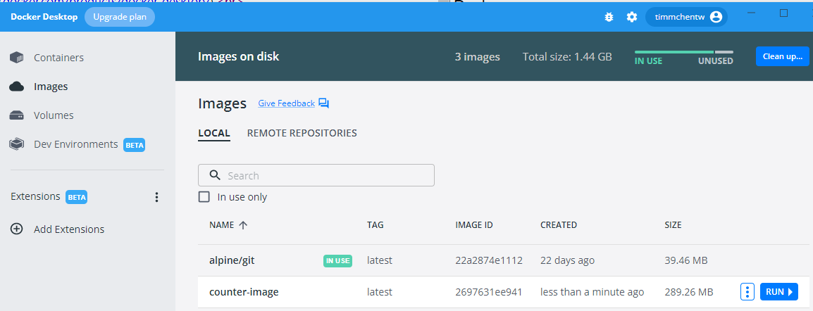
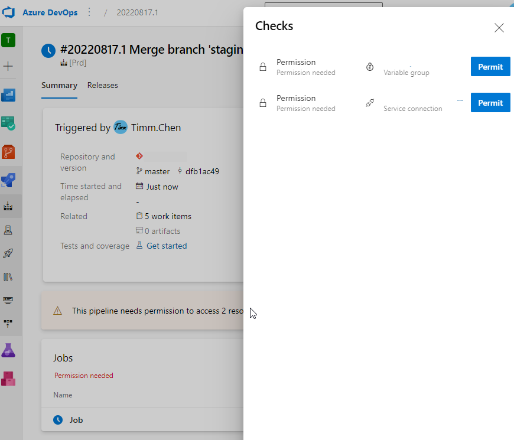

# Container

- [Container](#container)
  - [Docker](#docker)
  - [Docker Compose](#docker-compose)
  - [Dotnet Core](#dotnet-core)
  - [Azure Container Registry](#azure-container-registry)
  - [Azure Pipeline \& Web App](#azure-pipeline--web-app)
  - [Selenium Grid](#selenium-grid)
    - [開發流程步驟](#開發流程步驟)
    - [佈署步驟](#佈署步驟)
  - [Nginx](#nginx)
  - [IIS](#iis)
  - [SQL Server](#sql-server)
  - [References](#references)

## Docker

本機電腦安裝Docker desktop，對於Docker的上手較為友善，可藉由UI了解container, image, repository之間的關係 </br>

- [DockerDesktop](https://www.docker.com/products/docker-desktop/) </br>
- [DockerHub](https://hub.docker.com) </br>

下方為Docker desktop的Sample code，練習如何將pull, build, run & push image

```PowerShell
#First, clone a repository
docker run --name repo alpine/git clone https://github.com/docker/getting-started.git
docker cp repo:/git/getting-started/ .

#Now, build the image
cd getting-started
docker build -t docker101tutorial .

#Run your first container
docker run -d -p 80:80 \ --name docker-tutorial docker101tutorial

#Now save and share your image
docker tag docker101tutorial timmchentw/docker101tutorial        
docker push timmchentw/docker101tutorial
```

## Docker Compose

Docker compose適合用於多個Container偕同運作的情況，可避免各自獨立的Container互相依賴時，沒有Run起來的情況

1. 建立docker-compose.yml檔案
    - version會影響語法
    - build & dockerfile是給專案Build所使用 (docker compose build)
    - image為實際執行container所抓下來的Repo image (docker compose push & pull)
    - ports須指定，才能讓其他service取用
    - depends_on須指定另一個service

   ```YAML
    version: '3.4'

    services:
    web:
        build:
        context: .
        dockerfile: MyProject/Dockerfile
        image: myregistry.azurecr.io/myproject_web
        ports:
        - '8080:80'
        environment:
            ASPNETCORE_ENVIRONMENT: Production
        depends_on:
        - selenium_grid

    selenium_grid:
        image: myregistry.azurecr.io/selenium-standalone-chrome:4.4.0-20220812
        ports:
        - '4444:4444'
        - '7900:7900'
        shm_size: 2gb
   ```

2. Docker-compose語法可參考[官方文件](https://docs.docker.com/compose/reference/)(常用如Build, Publish, Push, Merge...)，Azure pipeline可參考[Task文件](https://docs.microsoft.com/en-us/azure/devops/pipelines/tasks/build/docker-compose?view=azure-devops)

Ps. 可參考下方Visual Studio建立Docker專案，Debug後可在Docker Desktop上看到compose群組
    

## Dotnet Core

.Net core內建整合Docker，在建立專案時可勾選自動產生DockerFile，與Azure Web App的整合度也高，在簡單的container環境下容易上手

1. 參考[微軟官方文件](https://docs.microsoft.com/en-us/dotnet/core/docker/build-container?tabs=windows#create-the-dockerfile)說明
2. 新增DockerFile在.csproj資料夾內</br>(Visual Studio在建立Solution時勾選可自動產生)

    ```Dockerfile
    #See https://aka.ms/containerfastmode to understand how Visual Studio uses this Dockerfile to build your images for faster debugging.

    FROM mcr.microsoft.com/dotnet/aspnet:6.0 AS base
    WORKDIR /app
    EXPOSE 80
    EXPOSE 443

    FROM mcr.microsoft.com/dotnet/sdk:6.0 AS build
    WORKDIR /src
    COPY ["MyProject/MyProject.csproj", "MyProject/"]
    RUN dotnet restore "MyProject/MyProject.csproj"
    COPY . .
    WORKDIR "/src/MyProject"
    RUN dotnet build "MyProject.csproj" -c Release -o /app/build

    FROM build AS publish
    RUN dotnet publish "MyProject.csproj" -c Release -o /app/publish

    FROM base AS final
    WORKDIR /app
    COPY --from=publish /app/publish .
    ENTRYPOINT ["dotnet", "MyProject.dll"]
    ```

3. 在該路徑上一層(.sln所在資料夾)下執行Docker Build，產生image

    ```docker
    docker build -t counter-image -f MyProject/Dockerfile .
    :: counter-image is the name of image
    ```

    

4. 建立Container

    ```docker
    docker create --name core-counter counter-image
    :: core-counter is the name of container
    ```

    

5. Push Container到Dockerhub</br>(如使用Azure Container Registry存放私有Image，可參考[微軟官方文件](https://docs.microsoft.com/en-us/azure/container-registry/container-registry-get-started-docker-cli?tabs=azure-cli)進行佈署)

   ```docker
   # Tag on image
   docker tag counter-image dockerhub_user/counter-image:tag_name
   # Login to DockerHub
   docker login
   # Push to DockerHub
   docker push dockerhub_user/counter-image:tag_name
   ```

6. 有多個Container同時執行與相依的情況，需額外新增docker-compose.yml

    Ps. VS支援自動產生docker compose檔案 (可直接在Docker Desktop Debug)
    
    

## Azure Container Registry

類似於DockerHub，用於存放Private Container Images (可與Web App整合)，其Image格式為XXX.azurecr.io/IMAGE_NAME

1. 建立Azure container Registry
2. 使用Visual Studio or Pipeline佈署到Azure container Registry </br>
   (Pipeline YAML語法參考下方Pipeline說明)
3. 建立Azure Web App or Function (Linux & Docker)
    
4. 建立時直接綁定Azure Container Registry中的Images & Tag
   
5. 可直接在Deployment Center直接設定CD、或可之後用Azure pipeline覆蓋設置
    

※ Public image (e.g. DockerHub) 可使用Azure CLI匯入ACR (參考[官方文件](https://docs.microsoft.com/en-us/azure/container-registry/container-registry-import-images?tabs=azure-cli)) </br>

```AzureCLI
az login
```

```AzureCLI
az acr import \
  --name myregistry \
  --source docker.io/library/hello-world:latest \
  --image hello-world:latest
```

※ 自動清理Image請參考[官方文件](https://docs.microsoft.com/en-us/azure/container-registry/container-registry-auto-purge)

## Azure Pipeline & Web App

以下方法整合Azure Pipeline (YAML)、Azure Container Registry (ACR) 與 Azure Web App (Linux Container)，讓.Net Core Website佈署到雲端環境


1. Docker compose build
2. Docker compose push (Azure Container Registry)
3. Azure Web App deploy</br>

    ```YAML
    # ASP.NET Core (.NET Framework)
    # Build and test ASP.NET Core projects targeting the full .NET Framework.
    # Add steps that publish symbols, save build artifacts, and more:
    # https://docs.microsoft.com/azure/devops/pipelines/languages/dotnet-core

    trigger:
    - production

    pool:
    vmImage: 'ubuntu-latest'

    variables:
    - group: MyLibrary_Variables # From Azure Library
    - name: solution
        value: '**/*.sln'
    - name: buildPlatform
        value: 'Any CPU'
    - name: buildConfiguration
        value: 'Release'
    - name: AzureSubscription
        value: 'MySubscription (...)'
    - name: AzureContainerRegistry
        value: '{"loginServer":"myproject.azurecr.io", "id" : "/subscriptions/.../resourceGroups/MyResGroup/providers/Microsoft.ContainerRegistry/registries/myregistry"}'
    - name: DockerComposeFile
        value: 'docker-compose.staging.yml'

    steps:

    - task: DockerCompose@0
    inputs:
        containerregistrytype: 'Azure Container Registry'
        dockerComposeFile: '$(DockerComposeFile)'
        action: 'Build services'
        additionalImageTags: '$(Build.BuildNumber)'

    - task: DockerCompose@0
    inputs:
        containerregistrytype: 'Azure Container Registry'
        azureSubscription: '$(AzureSubscription)'
        azureContainerRegistry: '$(AzureContainerRegistry)'
        dockerComposeFile: '$(DockerComposeFile)'
        action: 'Push services'
        additionalImageTags: '$(Build.BuildNumber)'

    # Deploy to web app (May move to release pipeline)
    - task: AzureWebAppContainer@1
      inputs:
        azureSubscription: '$(AzureSubscription)'
        appName: 'MyAzureWebApp'
        containers: 'myregistry.azurecr.io/myproject_web:$(Build.BuildNumber)'
        multicontainerConfigFile: '$(DockerComposeFile)'

    ```

    ※第一次Run會有Registry & App Service的Permission Approve
    

    ※如需設定YAML Approval，參考[這篇文章](https://www.programmingwithwolfgang.com/deployment-approvals-yaml-pipeline)

    ※ Docker Debug資訊參考Diagnose and solve problems (Application Logs→Container Issues)
        
4. 如需將CD拆分成Release pipeline，須注意將docker-compose.yml push到Artifact再取出使用</br>
(下例包含將現有的docker-compose.yml中的image加入TAG並改名，原因為Azure Web App在目前(2022)還尚未支援docker-compose merge的產出格式)

    ```YAML
    # Push compose config for release pipelines 
    # (Azure Web App doesn't support "merged docker-compose.yml" file)
    - task: PowerShell@2
    inputs:
        targetType: 'inline'
        script: |
        # Source: https://mjc.si/2020/10/08/modify-yml-files-with-powershell/
        # Install and import the `powershell-yaml` module
        # Install module has a -Force -Verbose -Scope CurrentUser arguments which might be necessary in your CI/CD environment to install the module
        Install-Module -Name powershell-yaml -Force -Verbose -Scope CurrentUser
        Import-Module powershell-yaml
        
        # LoadYml function that will read YML file and deserialize it
        function LoadYml {
            param (
                $FileName
            )
            # Load file content to a string array containing all YML file lines
            [string[]]$fileContent = Get-Content $FileName
            $content = ''
            # Convert a string array to a string
            foreach ($line in $fileContent) { $content = $content + "`n" + $line }
            # Deserialize a string to the PowerShell object
            $yml = ConvertFrom-YAML $content
            # return the object
            Write-Output $yml
        }
        
        # WriteYml function that writes the YML content to a file
        function WriteYml {
            param (
                $FileName,
                $Content
            )
            #Serialize a PowerShell object to string
            $result = ConvertTo-YAML $Content
            #write to a file
            Set-Content -Path $FileName -Value $result
        }
        
        # Loading yml, setting new values and writing it back to disk
        $yml = LoadYml "$(Build.SourcesDirectory)/$(DockerComposeFile)"
        $yml.services.web.image = $yml.services.web.image + ":" + $(Build.BuildNumber)
        WriteYml "$(Build.StagingDirectory)/docker-compose.yml" $yml

    # Push to artifact (For release pipeline)
    - task: PublishPipelineArtifact@1
    inputs:
        targetPath: '$(Build.StagingDirectory)/docker-compose.yml'
        publishLocation: 'pipeline'

    ```

    
    
</br>
</br>
※ Azure web app對於Docker compose，有一些[未支援的限制](https://docs.microsoft.com/en-us/azure/app-service/configure-custom-container?pivots=container-linux#docker-compose-options):</br>
  (1) Port只能使用最簡單的short syntax

    ```yaml
    services:
    myservice1:
        port:
        # 支援
        '8080:80'

        # 不支援
        #- published: 8080
        #target: 80
        #protocol: tcp
        #mode: host
    ```

    (2) version要放第一行 </br>
    (3) depends_on會被忽略 </br>
    (4) 所有image只能從同一個registry取得 (如ACR, DockerHub)，不可混用 </br>
    (5) 不支援Merge docker-compose.yml </br>
    ※ 因此使用Docker compose command merge YAML檔(如下方) 的格式，會使得Web App Start失敗

    ```CMD
    docker-compose -d docker.compose.yml -d docker.compose.override.yml config
    ```

## Selenium Grid

優點: 已將瀏覽器 & Web Driver整合到容器當中，其隔離性與固定瀏覽器版本，使呼叫端不需頻繁更新瀏覽器與Web Driver! 且可以在Cloud-base web app中執行

### 開發流程步驟

用於本機開發，Debug "Call RemoteDriver"的運作狀況

1. 參考Selenium Docker (https://github.com/SeleniumHQ/docker-selenium)
2. 使用Docker指令安裝特定瀏覽器與版本 (-e是environment variables，SE_NODE_MAX_SESSIONS可設定最多平行呼叫的session數量)

    ```powershell
    docker run -d -p 4444:4444 -p 7900:7900 --shm-size="2g" -e SE_NODE_MAX_SESSIONS=1 selenium/standalone-firefox:4.3.0-20220726
    ```

    

3. 進入後台(URL:`http://localhost:4444/ui`)確認Selenium Grid狀態與Session
    
4. 程式端直接使用RemoteDriver連到losthost port 4444，即可調用

    ```C#
     var driver = new RemoteWebDriver(new Uri("http://localhost:4444/wd/hub"), new FirefoxOptions());
    driver.Navigate().GoToUrl("https://www.google.com/");
    ```

    

5. 關閉後Session將會釋出

    ```C#
    driver.Quit();
    ```

6. 日後Debug selenium皆須要Docker Run Selenium Container，避免RemoteDriver連不到的情況

### 佈署步驟

佈署環境需要透過docker-compose.yml檔案設定啟用container (包含版本TAG)，呼叫方法與本機Docker有些許差異

1. 須使用docker-compose.yml設定 Container Service

    ```YAML
    version: '3.4'

    services:
    selenium_grid:
        image: selenium/selenium-standalone-chrome:4.4.0-20220812
        ports:
        - '4444:4444'
        - '7900:7900'
        shm_size: 2gb
        environment:
        - SE_NODE_MAX_SESSIONS=1
    ```

2. 實際運作須使用docker-compose.yml當中的service name配合port做呼叫

   ```C#
   var driver = new RemoteWebDriver(new Uri("http://selenium_grid:4444/wd/hub"), new FirefoxOptions());
   ```

※ 須注意最多的Session數量限制(SE_NODE_MAX_SESSIONS最多為8)，否則在前面的session結束前，後面的session無法建立成功

## Nginx

## IIS

## SQL Server


## References

* [Docker Document](https://docs.docker.com/reference/)
* [Compose file version 3 reference](https://docs.docker.com/compose/compose-file/compose-file-v3/)
* [Understanding Docker Port Mappings](https://www.dev-diaries.com/social-posts/docker-port-mappings/)
* [Docker images for the Selenium Grid Server](https://github.com/SeleniumHQ/docker-selenium)
* [[Microsoft] How to customize Docker containers in Visual Studio](https://aka.ms/containerfastmode)
* [[Microsoft] Tutorial: Create a multi-container app with Docker Compose](https://learn.microsoft.com/en-us/visualstudio/containers/tutorial-multicontainer?view=vs-2022)
* [[Microsoft] Azure Pipelines - Docker Compose task](https://learn.microsoft.com/en-us/azure/devops/pipelines/tasks/build/docker-compose?view=azure-devops)
* [[黑暗執行緒] ASP.NET Core Docker 筆記 2 - 組合容器建構系統](https://blog.darkthread.net/blog/aspnetcore-docker-notes-2/)
* [[Neeldeep Roy] CI/CD using Azure DevOps to run Dot Net Core Based Docker Containers](https://medium.com/@neeldeep/ci-cd-using-azure-devops-to-run-dot-net-core-based-docker-containers-c65cc1c9aa4f)
* [[火車台北火車台北走走] Azure Container Registry](https://ithelp.ithome.com.tw/articles/10208580)
* [[Microsoft] Push your first image to your Azure container registry using the Docker CLI](https://learn.microsoft.com/en-us/azure/container-registry/container-registry-get-started-docker-cli?tabs=azure-cli)
* [[stackoverflow] Running public & private images on azure web service authentication issue](https://stackoverflow.com/questions/58977249/running-public-private-images-on-azure-web-service-authentication-issue)
* [Approvals for YAML Pipelines in Azure DevOps](https://www.programmingwithwolfgang.com/deployment-approvals-yaml-pipeline/)