# Visual Studio

- [Visual Studio](#visual-studio)
  - [Code snippet](#code-snippet)
  - [Shortcuts](#shortcuts)
    - [Display related](#display-related)
    - [Edit related](#edit-related)
  - [Power Tools](#power-tools)
  - [Team Explorer](#team-explorer)
    - [設定連接Remote Repostories](#設定連接remote-repostories)
  - [Test Explorer](#test-explorer)
  - [Live Share (Collabaration)](#live-share-collabaration)
  - [Code Map](#code-map)
  - [Debug](#debug)
  - [Task Runner Explorer](#task-runner-explorer)
  - [Parrellel Stacks](#parrellel-stacks)
  - [Exception Settings](#exception-settings)
  - [Issues](#issues)
    - [電腦自授權SSL出問題](#電腦自授權ssl出問題)
- [Visual Studio Code](#visual-studio-code)
  - [Settings](#settings)
  - [Extensions](#extensions)
    - [Markdown](#markdown)
    - [Language](#language)


## Code snippet

* `ctor` Constructor of class
* `prop` Property of class
* `///` Description for function & parameters
* `try` `swtich` `while` `for` `foreach`  `enum`
* 

## Shortcuts

### Display related

* `ctrl + -` `ctrl + shift + -` 上/下一個檢視紀錄
* `ctrl + f` `ctrl + shift + t` 搜尋/全域搜尋
* `ctrl + ,` `ctrl + t` Function & Property搜尋
* `ctrl + shift + space` 顯示Input Description
* `alt+2` 顯示Reference
* `ctrl + alt + pageup` `ctrl + alt + pagedown` 上/下一個Tab
* `ctrl + F12` 直接跳到繼承鍊Implement (介面隔離情況好用)
* `alt + F12` 同畫面預覽內容(Peek definition，不用跳檔案很讚!)
* `ctrl + k, ctrl + t` 檢視Call階層 (查找Reference極好用)
* `alt + home` 顯示所有繼承鍊Base

### Edit related

* `ctrl+w` 選取單字
* `ctrl+shift+l` 刪除單行
* `ctrl+x` 剪下單行
* `ctrl+c` 複製單行
* `ctrl+v` 貼上單行

## Power Tools

* 自動排序usings、刪除不必要空格、大括號換行等
* Visual Studio 2019版本直接在Settings當中設定Code Cleanup即可
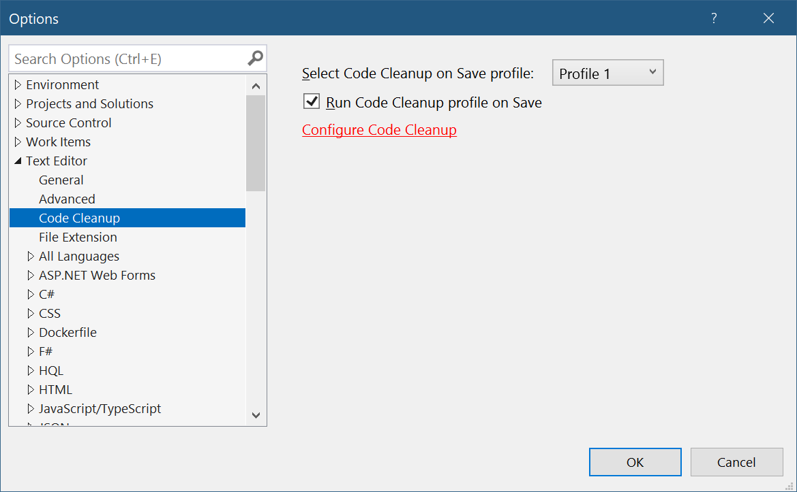
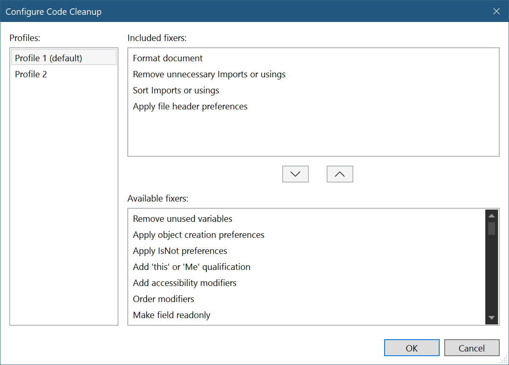

## Team Explorer

### 設定連接Remote Repostories
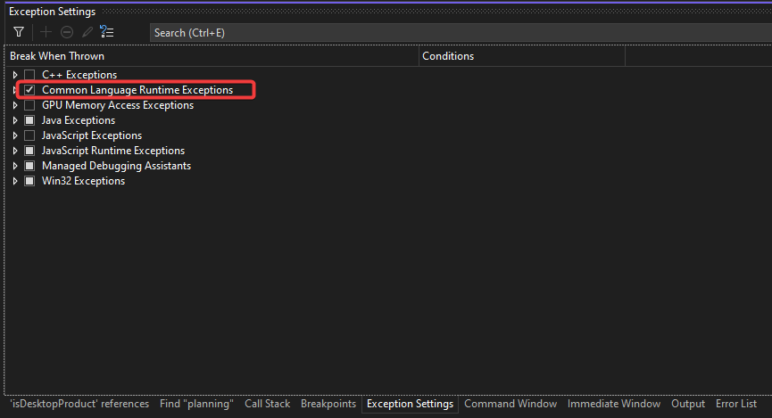
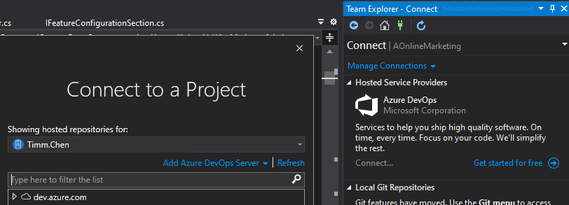

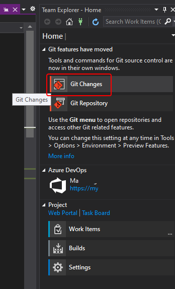
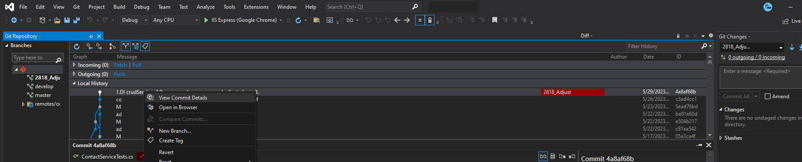
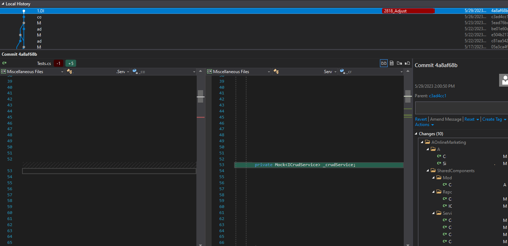

* [參考官方Github連結](https://github.com/github/VisualStudio/blob/master/docs/using/reviewing-a-pull-request-in-visual-studio.md)

## Test Explorer

## Live Share (Collabaration)

- 可像Google doc一樣即時協作Code & Build

## Code Map

1. 目標Function或Class右鍵→Code Map→Show on Code Map
    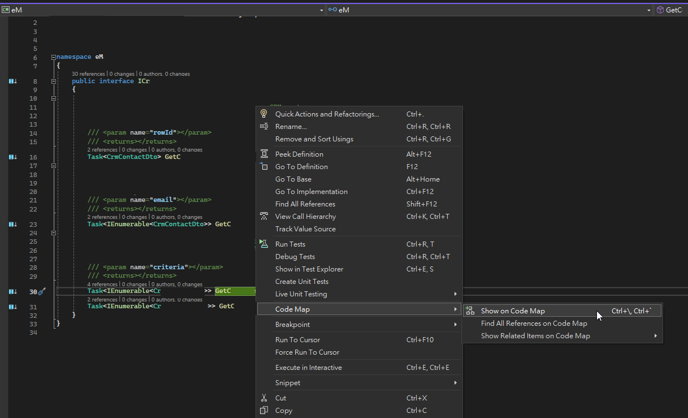
2. 右鍵目標→Find All References
    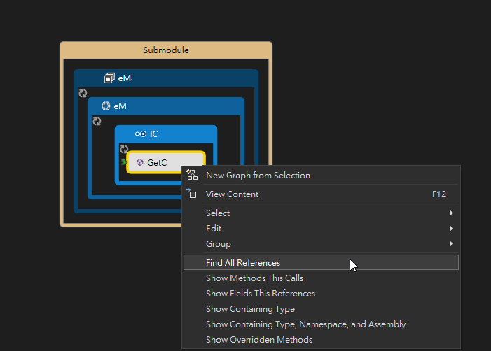

## Debug

- Attach to process
  - 可設定Attach to 某一個正在執行的process，如另一個Project app、或是遠端電腦、Web App等
    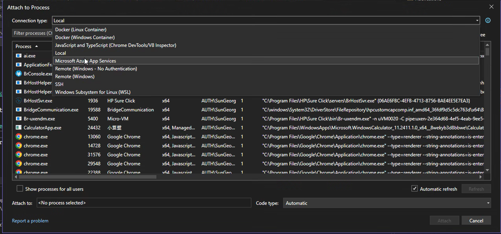

## Task Runner Explorer

## Parrellel Stacks

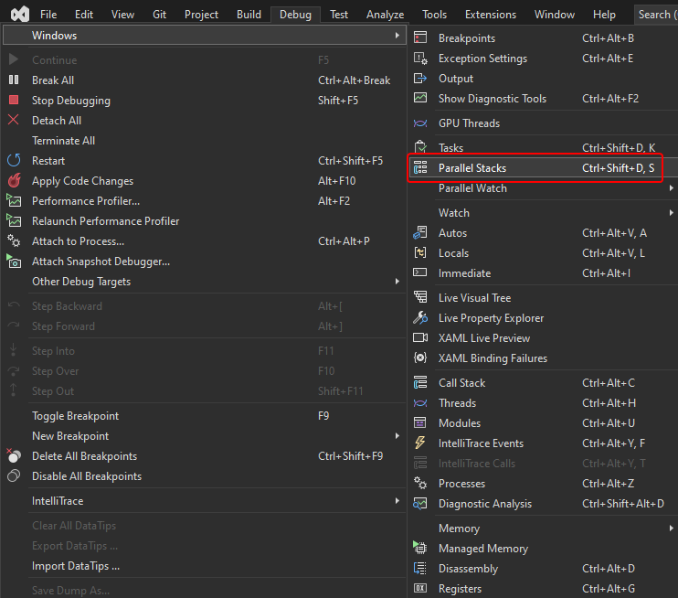
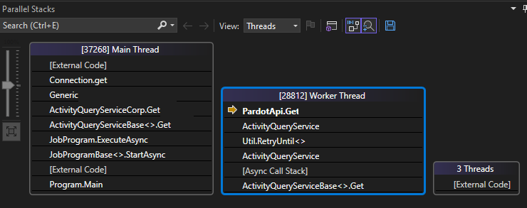

## Exception Settings

* 可設定當Exception出現時要不要停住


## Issues

### 電腦自授權SSL出問題

1. 如使用Visual Studio建立的自授權SSL，預設localhost Chrome無法吃到
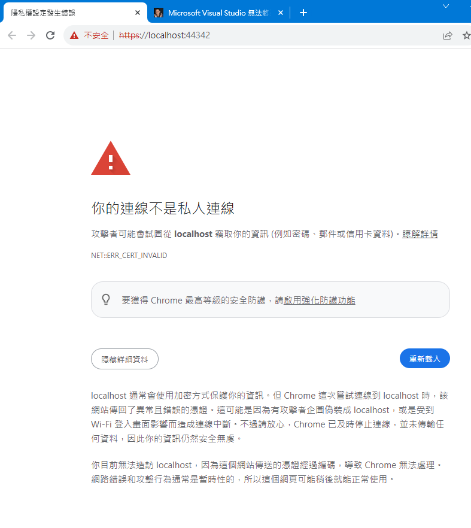
1. 查看錯誤訊息，確認localhost 自授權SSL的序號
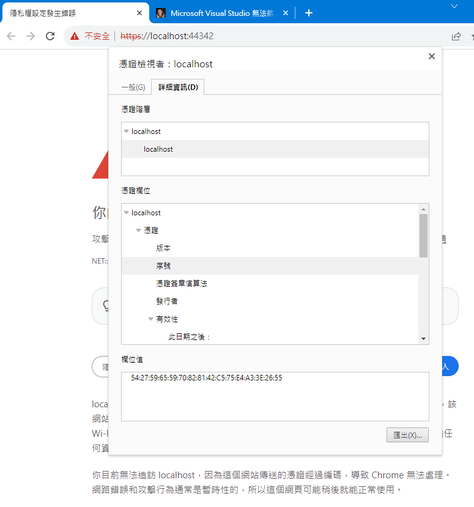
1. Win 10搜尋"憑證"，進入憑證管理工具，在個人分類下找到localhost對一下序號
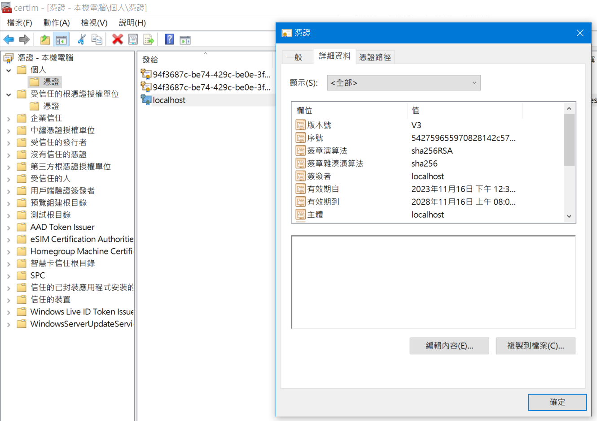
1. 試著重開機，不行的話輸入以下CMD語法重設 (完成後要重開機)

```Bash
dotnet dev-certs https --clean
dotnet dev-certs https --trust
```

# Visual Studio Code

## Settings

- UI

```json
"workbench.editor.wrapTabs": true,
"workbench.editor.pinnedTabsOnSeparateRow": true,
```

- Format

```C#
"editor.formatOnSave": false,
"[csharp]": {
    "editor.formatOnSave": true,
    "editor.defaultFormatter": "ms-dotnettools.csharp"
}
"csharp.debug.justMyCode": false,
"dotnet.completion.showCompletionItemsFromUnimportedNamespaces": true,
//"csharp.suppressHiddenDiagnostics": false,
,
"[javascript]": {
    "editor.formatOnSave": true
},
"[html]": {
    "editor.formatOnSave": false
},
```

- OmniSharp

```json

```

- AI

```json
"editor.aiStats.enabled": true,
```


## Extensions

### Markdown

- Markdown All in One
- Marketing Preview Github Styling
- markdownlint in One

### Language

- Poor man's SQL formatter
- C#
- SQL
- 